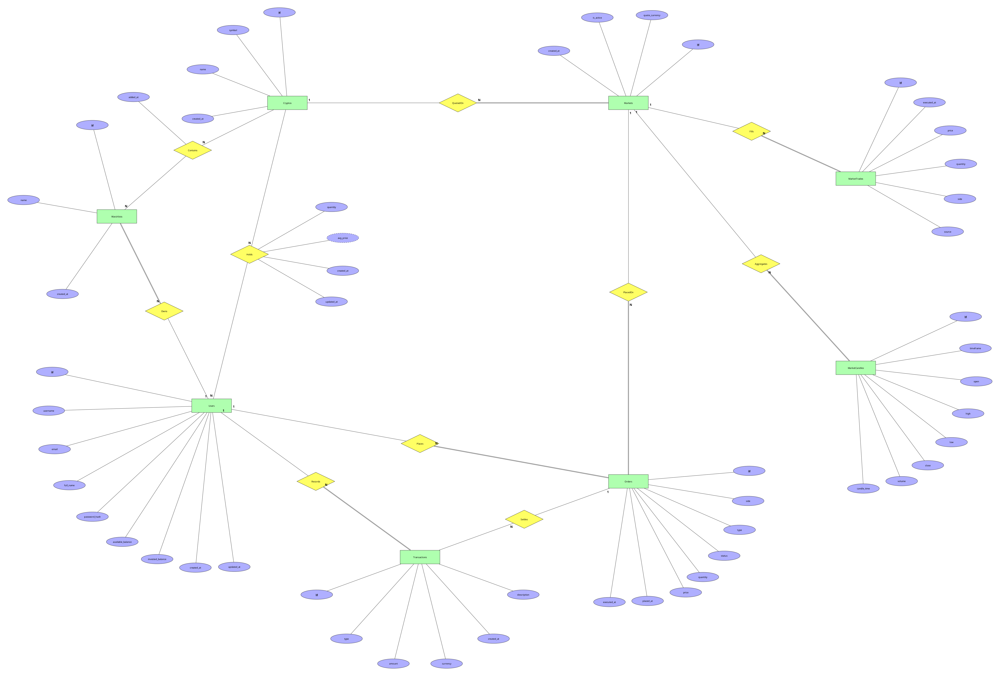

# Entity-Relationship Model v.01

## Diagram



Attachments for this page: `ERModel_v01.xml` (TerraER source) and `ERModel_v01.png`
(exported image). Open the source with TerraER 3.11:

```sh
java -jar TerraER3.11.jar     # then File → Open → ERModel_v01.xml
```

Notation: Chen. Rectangles are entity sets, diamonds are relationships, ellipses
are attributes, underlined ellipses are primary keys, the dashed ellipse is a
derived attribute. A double line between an entity set and a relationship marks
**total participation** (every instance of that entity set must participate); a
single line marks partial participation.

Two deliberate modeling decisions worth stating up front:

- **No foreign keys appear in the diagram.** Connections between entity sets are
  expressed as relationships, per the notation. Foreign-key columns appear only
  in the relational model in [RelationalDesign](../P2-RelationalDesign/RelationalDesign.md).
- **`Holds` and `Contains` are relationships, not entity sets.** Both are M:N and
  both carry their own attributes, which is exactly what a Chen relationship is
  for. They become tables (`holdings`, `watchlist_items`) only in P2.

## Data requirements

### Entity sets

#### Users
Registered participants of the platform. Every action in the simulation is
attributed to a user, and the two balance attributes are what makes the
simulation work: cash that is free to trade is tracked separately from cash that
is currently committed to open positions, so the platform can refuse a purchase
without having to recompute the whole portfolio first.

- **Candidate keys:** `{id}`, `{username}`, `{email}`. Primary key: **`id`**.
  A surrogate UUID was chosen because it is opaque and stable — `username` and
  `email` are both things a user may legitimately want to change later, and
  every relationship in the diagram points at `Users`, so a mutable key would
  propagate changes across the whole database.
- **Attributes:**
  - `id` — UUID, required, primary key.
  - `username` — text, max 50, required, unique.
  - `email` — text, max 255, required, unique, must contain `@`.
  - `full_name` — text, max 200, optional.
  - `password_hash` — text, max 255, required. Never the password itself; the
    prototype stores a SHA-256 hex digest.
  - `available_balance` — numeric(18,4), required, default 0, must be ≥ 0.
  - `invested_balance` — numeric(18,4), required, default 0, must be ≥ 0.
  - `created_at` — timestamp with time zone, required, defaults to now.
  - `updated_at` — timestamp with time zone, optional (null until first change).

#### Cryptos
The catalog of crypto assets the platform knows about. Kept separate from
`Markets` because an asset exists independently of the pairs it is traded in —
the same asset can be quoted against several currencies, and a user's holding is
in the *asset*, not in a particular pair.

- **Candidate keys:** `{id}`, `{symbol}`. Primary key: **`id`**, for the same
  reason as in `Users`; `symbol` is kept as a unique natural key because that is
  what users type and see.
- **Attributes:**
  - `id` — UUID, required, primary key.
  - `symbol` — text, max 20, required, unique (e.g. `BTC`).
  - `name` — text, max 255, required (e.g. `Bitcoin`).
  - `created_at` — timestamptz, required, defaults to now.

#### Markets
A tradeable pair: one crypto asset quoted in one currency, e.g. BTC/USD. This is
where prices live, and it is the thing an order is placed *on*. Modeled as its
own entity set rather than an attribute of `Cryptos` because a market has its own
lifecycle — it can be deactivated without deleting the asset — and because
trades, candles and orders all reference the pair, not the asset.

- **Candidate keys:** `{id}`, `{crypto_id, quote_currency}` — that pair is
  unique by definition, since a given asset can only be quoted once per
  currency. Primary key: **`id`**, so that the many entity sets referencing a
  market carry one narrow column instead of a composite key.
- **Attributes:**
  - `id` — UUID, required, primary key.
  - `quote_currency` — text, exactly 3 characters, required, default `USD`.
  - `is_active` — boolean, required, default true. Inactive markets are hidden
    from the trading menus but keep their history.
  - `created_at` — timestamptz, required, defaults to now.

#### Orders
A user's instruction to buy or sell on a market. Needed as a separate entity set
because an order is a record of *intent* that outlives its execution: it keeps
the requested quantity and price even after it has been filled, which is what
makes the ledger auditable.

- **Candidate keys:** `{id}` only. There is no natural key — the same user can
  place two identical orders on the same market in the same second, and both are
  legitimately distinct. Primary key: **`id`**.
- **Attributes:**
  - `id` — UUID, required, primary key.
  - `side` — text, required, restricted to `buy` or `sell`.
  - `type` — text, required, restricted to `market` or `limit`. The prototype
    executes only `market` orders; `limit` exists so the model does not have to
    change when limit orders are implemented.
  - `status` — text, required, restricted to `open`, `executed`, `cancelled`.
  - `quantity` — numeric(20,4), required, must be > 0.
  - `price` — numeric(18,6), optional — null for a market order until it fills,
    then the fill price.
  - `placed_at` — timestamptz, required, defaults to now.
  - `executed_at` — timestamptz, optional, set when the order fills.

#### Transactions
The financial ledger: every movement of virtual cash, in one place. This exists
so that a balance is never just a number someone edited — it is the sum of an
auditable list of entries, which is also what the "explain every step" goal of
the project needs.

- **Candidate keys:** `{id}` only. Primary key: **`id`**.
- **Attributes:**
  - `id` — UUID, required, primary key.
  - `type` — text, required, restricted to `deposit`, `buy`, `sell`, `fee`.
  - `amount` — numeric(18,4), required. Signed: negative for money leaving the
    cash balance, positive for money arriving.
  - `currency` — text, exactly 3 characters, required, default `USD`.
  - `created_at` — timestamptz, required, defaults to now.
  - `description` — text, optional, free-form human-readable explanation.

#### MarketTrades
Individual executed trades on a market, from the user's own fills and from the
market simulator. This is the single source of truth for the current price: the
price of a market is the price of its most recent trade, never a column someone
writes directly.

- **Candidate keys:** `{id}`. In principle `{market_id, executed_at}` looks
  unique, but two trades can share a timestamp, so it is not a safe key.
  Primary key: **`id`** (a plain auto-incrementing integer here rather than a
  UUID, because this is the highest-volume entity set and it is only ever read
  in timestamp order, never referenced by anything else).
- **Attributes:**
  - `id` — integer, required, primary key, auto-generated.
  - `executed_at` — timestamptz, required.
  - `price` — numeric(18,6), required, must be > 0.
  - `quantity` — numeric(20,6), required, must be > 0.
  - `side` — text, optional, `buy` or `sell`.
  - `source` — text, max 50, required, default `simulation`. Distinguishes a
    simulated trade from a user's own fill (`user`).

#### MarketCandles
OHLCV aggregates per market and timeframe — the data a price chart is drawn
from. Stored rather than computed on the fly because the point of the project is
a chart-driven interface, and re-aggregating the whole trade history for every
screen refresh does not scale.

- **Candidate keys:** `{id}`, and `{market_id, timeframe, candle_time}` — a
  market has exactly one candle per timeframe per time bucket. Primary key:
  **`id`**; the composite is enforced as a uniqueness rule because it is the
  real-world constraint and it is what prevents duplicate candles.
- **Attributes:**
  - `id` — integer, required, primary key, auto-generated.
  - `timeframe` — text, required, restricted to `1m`, `5m`, `1h`, `1d`.
  - `open`, `high`, `low`, `close` — numeric(18,6), all required.
  - `volume` — numeric(20,6), required.
  - `candle_time` — timestamptz, required — the start of the bucket.

#### Watchlists
A named list of assets a user wants to monitor. A separate entity set rather than
a flag on the relationship between users and assets, because a user may want
several lists ("long term", "watching today") and each needs its own name.

- **Candidate keys:** `{id}`. `{user_id, name}` would also work if list names
  are required to be unique per user; the model does not impose that, so it is
  not listed as a candidate key. Primary key: **`id`**.
- **Attributes:**
  - `id` — UUID, required, primary key.
  - `name` — text, max 100, required.
  - `created_at` — timestamptz, required, defaults to now.

### Relationships

#### QuotedOn — Cryptos (1) : Markets (N), total on Markets
Ties a market to the asset it trades. One asset can be quoted in many markets;
every market must have exactly one asset, hence total participation on the
`Markets` side. No attributes of its own.

#### PlacedOn — Markets (1) : Orders (N), total on Orders
Records which market an order was placed on. Every order must name a market;
a market may have no orders yet. No attributes.

#### Places — Users (1) : Orders (N), total on Orders
Records who placed an order. Every order belongs to exactly one user; a new user
has no orders. No attributes.

#### Records — Users (1) : Transactions (N), total on Transactions
Attributes each ledger entry to a user. Every entry belongs to exactly one user.
No attributes.

#### Settles — Orders (1) : Transactions (N), partial on both sides
Links a ledger entry to the order that caused it. Partial on the `Transactions`
side because deposits have no originating order, and partial on the `Orders` side
because an order that never executes never produces a ledger entry. This is why
the corresponding column is nullable in P2. No attributes.

#### Fills — Markets (1) : MarketTrades (N), total on MarketTrades
Every executed trade happened on exactly one market. No attributes.

#### Aggregates — Markets (1) : MarketCandles (N), total on MarketCandles
Every candle summarises trades of exactly one market. No attributes.

#### Owns — Users (1) : Watchlists (N), total on Watchlists
Every watchlist belongs to exactly one user. No attributes.

#### Holds — Users (M) : Cryptos (N), partial on both sides, **with attributes**
A user's position in an asset. M:N because one user holds many assets and one
asset is held by many users, and partial on both sides because a user may hold
nothing and an asset may be held by nobody. Modeled as a relationship rather
than an entity set because a position has no identity of its own — it is
entirely described by *which user*, *which asset*, and how much.

- **Attributes:**
  - `quantity` — numeric(20,4), required, must be ≥ 0.
  - `avg_price` — numeric(18,6), required, ≥ 0, **derived** (dashed ellipse):
    the weighted average of the prices at which the position was accumulated.
    It is derivable from the buy history, and is stored anyway so that
    unrealised P/L can be shown without replaying the whole ledger.
  - `created_at` — timestamptz, required, defaults to now.
  - `updated_at` — timestamptz, optional.

#### Contains — Watchlists (M) : Cryptos (N), partial on both sides, **with attribute**
Which assets are on which watchlist. M:N: a list holds many assets, an asset
appears on many lists. Partial on both sides — an empty list is valid and an
asset need not be on any list.

- **Attributes:**
  - `added_at` — timestamptz, required, defaults to now. Recorded so a list can
    be shown in the order the user built it.

## Entity-Relationship Model History

- **v01** — First complete version. Built from the entity notes in
  [`ep-diagram.md`](ep-diagram.md) (the initial hand-written model), with three
  changes made to that initial model while drawing it:
  1. `Markets` was promoted from an implied attribute of the asset to its own
     entity set, so that prices, orders, trades and candles can all reference a
     pair rather than an asset.
  2. `holdings` and `watchlist_items` were re-expressed as the M:N relationships
     `Holds` and `Contains` with their own attributes, instead of entity sets
     with foreign keys — the initial notes listed them as tables, which is a
     relational concept that does not belong in a Chen ERD.
  3. `avg_price` was marked as a derived attribute rather than a plain one, to
     make the denormalisation explicit rather than hidden.

Reasoning for the AI-assisted part of this phase, and the full interaction log,
are on [ERModelAIUsage](ERModelAIUsage.md).
