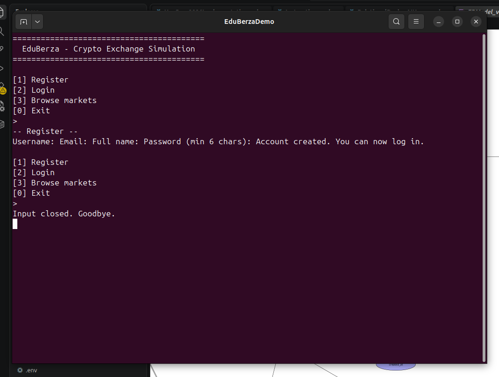

# Use-case 0001 Implementation — Register

**Initiating actor:** Visitor. **Source file:** `server/auth.go`, function `Register`.

## Scenario (implemented)

1. **User** chooses option `[1] Register` from the anonymous menu.


2. **System** prompts for username, email, full name and password (`server/auth.go:20-23`).

3. **User** enters the values.

4. **System** validates (empty checks, `@` in email, ≥ 6 chars in password) and then asks the database:

   ```sql
   SELECT EXISTS(
       SELECT 1 FROM users WHERE username = $1 OR email = $2
   );
   ```


5. **System** inserts the new row (password hashed in Go, not in SQL, to keep hashing identical between register and login):

   ```sql
   INSERT INTO users (username, email, full_name, password_hash, available_balance)
   VALUES ($1, $2, $3, $4, 0);
   ```

6. **System** confirms: `Account created. You can now log in.`

   

## How to reproduce

```sh
./eduberza -init      # optional: reset to a known state
./eduberza
# choose [1] Register, then enter username / email / full name / password
```

The screenshot above is from an actual run: registering `marko` /
`marko@example.com`, followed by the confirmation line.
