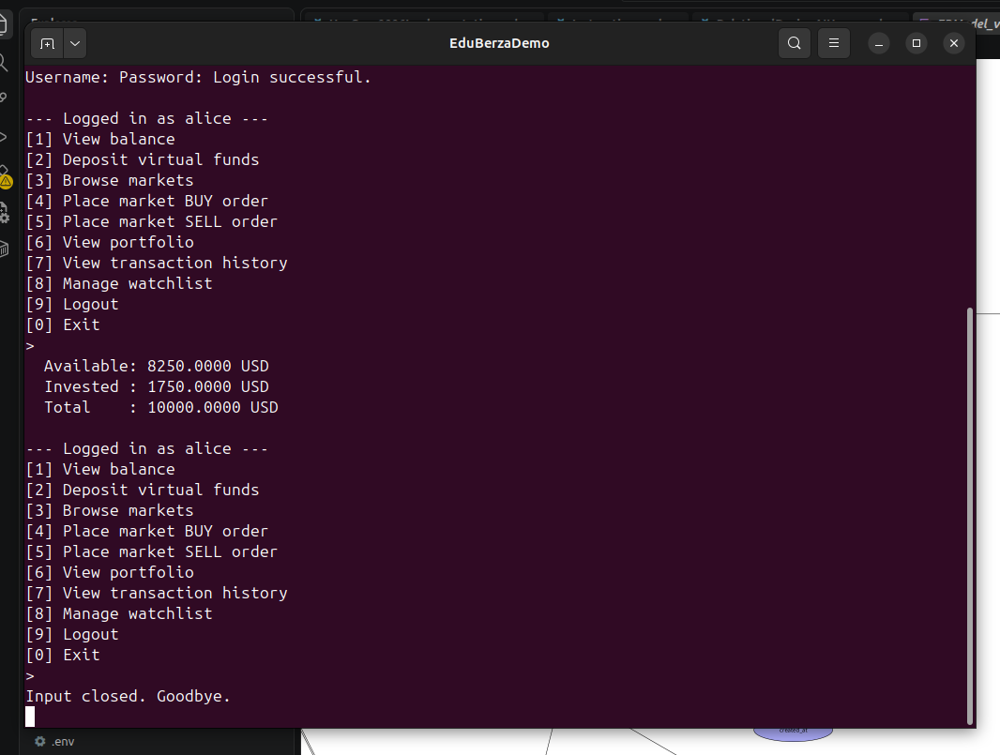

# Use-case 0002 Implementation — Log in

**Initiating actor:** Visitor. **Source file:** `server/auth.go`, function `Login` + `authenticate`.

## Scenario (implemented)

1. **User** chooses option `[2] Login`.


2. **System** prompts for username and password.

3. **User** enters `alice` / `test123`.

4. **System** looks up the user and compares hashes:

   ```sql
   SELECT id, password_hash FROM users WHERE username = $1;
   ```

   The Go side (`authenticate` in `server/auth.go`) compares the returned `password_hash` against `sha256hex(entered_password)`.

5. **System** on success stores `{UserID, Username}` in the in-process `Session` and shows the authenticated menu.

   

## Seed credentials

| Username | Password | Balance |
|----------|----------|---------|
| `alice`    | `test123` | 10000.00 USD |
| `bob`      | `test123` |  5000.00 USD |
| `charlie`  | `test123` |  2500.00 USD |
