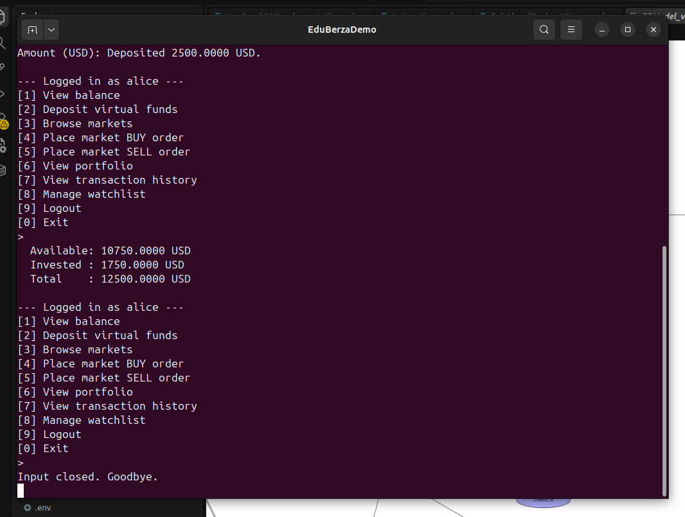

# Use-case 0003 Implementation — Deposit

**Initiating actor:** Trader. **Source file:** `server/account.go`, function `Deposit`.

## Scenario (implemented)

1. **User** chooses `[2] Deposit virtual funds`.
2. **System** prompts for an amount in USD.
3. **User** enters `2500`.
4. **System** opens a database transaction and runs:

   ```sql
   BEGIN;
     UPDATE users
        SET available_balance = available_balance + $1,
            updated_at        = now()
      WHERE id = $2;
     INSERT INTO transactions (user_id, type, amount, currency, description)
     VALUES ($2, 'deposit', $1, 'USD', 'Virtual deposit');
   COMMIT;
   ```

   

5. **System** confirms: `Deposited 2500.0000 USD.`

## Verification

Right after the deposit, `[1] View balance` runs:

```sql
SELECT available_balance, invested_balance FROM users WHERE id = $1;
```

In the screenshot above, alice starts from the seed state (available 8250.00,
invested 1750.00) and ends at available **10750.00** — increased by exactly the
2500.00 deposited, with `invested_balance` untouched.
