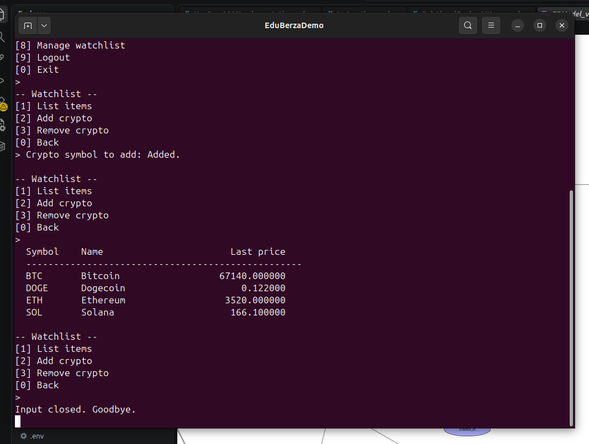

# Use-case 0007 Implementation — Watchlist

**Initiating actor:** Trader. **Source file:** `server/watchlist.go`.

## Scenario (implemented)

1. **User** chooses `[8] Manage watchlist`.
2. **System** ensures a default watchlist exists:

   ```sql
   SELECT id FROM watchlists WHERE user_id = $1 ORDER BY created_at LIMIT 1;
   -- else
   INSERT INTO watchlists (user_id, name) VALUES ($1, 'Favorites') RETURNING id;
   ```

3. **System** offers the submenu: List, Add, Remove, Back.

### List

```sql
SELECT c.symbol, c.name, COALESCE(lp.price, 0)
  FROM watchlist_items wi
  JOIN crypto c ON c.id = wi.crypto_id
  LEFT JOIN markets m ON m.crypto_id = c.id AND m.quote_currency = 'USD'
  LEFT JOIN v_latest_prices lp ON lp.market_id = m.id
 WHERE wi.watchlist_id = $1
 ORDER BY c.symbol;
```



### Add

```sql
SELECT id FROM crypto WHERE upper(symbol) = upper($1);

INSERT INTO watchlist_items (watchlist_id, crypto_id)
VALUES ($watchlist_id, $crypto_id)
ON CONFLICT (watchlist_id, crypto_id) DO NOTHING;
```

Re-adding the same symbol is a no-op thanks to the unique constraint + `ON CONFLICT`.

### Remove

```sql
DELETE FROM watchlist_items
 WHERE watchlist_id = $1
   AND crypto_id = (SELECT id FROM crypto WHERE upper(symbol) = upper($2));
```
