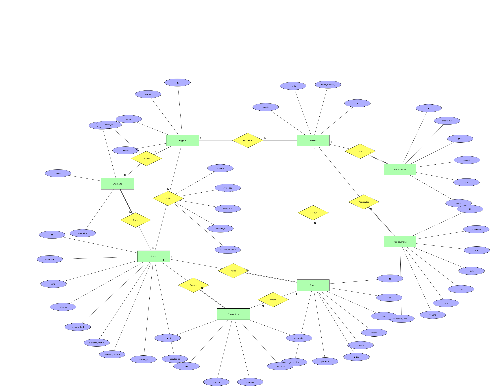

# Entity-Relationship Model v.03

## Diagram

Notation: Chen. Rectangles are entity sets, diamonds are relationships, ellipses
are attributes, underlined ellipses are primary keys, the dashed ellipse is a
derived attribute. A double line between an entity set and a relationship marks
**total participation** (every instance of that entity set must participate); a
single line marks partial participation.

Two deliberate modeling decisions worth stating up front:

- **No foreign keys appear in the diagram.** Connections between entity sets are
  expressed as relationships, per the notation. Foreign-key columns appear only
  in the relational model in [RelationalDesign](../P2-RelationalDesign/RelationalDesign.md).
- **`Holds` and `Contains` are relationships, not entity sets.** Both are M:N and
  both carry their own attributes, which is exactly what a Chen relationship is
  for. They become tables (`holdings`, `watchlist_items`) only in P2.

## Data requirements

Each entity set is given as a short rationale for why it exists as its own set,
its keys, and its attributes as a table. Each relationship is given as its
cardinality and participation, a short rationale, and — where it carries data —
an attribute table.

### Entity sets

#### Users
Registered participants of the platform. Every action in the simulation is
attributed to a user, and the two balance attributes are what makes the
simulation work: cash that is free to trade is tracked separately from cash
that is currently committed to open positions, so the platform can refuse a
purchase without having to recompute the whole portfolio first.

**Keys:** candidates `{id}`, `{username}`, `{email}`; primary key **`id`**. A
surrogate UUID was chosen because it is opaque and stable — `username` and
`email` are both things a user may legitimately want to change later, and
every relationship in the diagram points at `Users`, so a mutable key would
propagate changes across the whole database.

| Attribute | Type | Constraints |
|---|---|---|
| `id` | UUID | PK, required |
| `username` | text(50) | required, unique |
| `email` | text(255) | required, unique, contains `@` |
| `full_name` | text(200) | optional |
| `password_hash` | text(255) | required — never the password itself; the prototype stores a SHA-256 hex digest |
| `available_balance` | numeric(18,4) | required, default 0, ≥ 0 |
| `invested_balance` | numeric(18,4) | required, default 0, ≥ 0 |
| `created_at` | timestamptz | required, defaults to now |
| `updated_at` | timestamptz | optional (null until first change) |

#### Cryptos
The catalog of crypto assets the platform knows about. Kept separate from
`Markets` because an asset exists independently of the pairs it is traded in —
the same asset can be quoted against several currencies, and a user's holding is
in the *asset*, not in a particular pair.

**Keys:** candidates `{id}`, `{symbol}`; primary key **`id`**, for the same
reason as in `Users`. `symbol` is kept as a unique natural key because that is
what users type and see.

| Attribute | Type | Constraints |
|---|---|---|
| `id` | UUID | PK, required |
| `symbol` | text(20) | required, unique (e.g. `BTC`) |
| `name` | text(255) | required (e.g. `Bitcoin`) |
| `created_at` | timestamptz | required, defaults to now |

#### Markets
A tradeable pair: one crypto asset quoted in one currency, e.g. BTC/USD. This is
where prices live, and it is the thing an order is placed *on*. Modeled as its
own entity set rather than an attribute of `Cryptos` because a market has its own
lifecycle — it can be deactivated without deleting the asset — and because
trades, candles and orders all reference the pair, not the asset.

**Keys:** candidates `{id}`, `{crypto_id, quote_currency}` — that pair is
unique by definition, since a given asset can only be quoted once per
currency; primary key **`id`**, so that the many entity sets referencing a
market carry one narrow column instead of a composite key.

| Attribute | Type | Constraints |
|---|---|---|
| `id` | UUID | PK, required |
| `quote_currency` | text(3) | required, default `USD` |
| `is_active` | boolean | required, default true — inactive markets are hidden from the trading menus but keep their history |
| `created_at` | timestamptz | required, defaults to now |

#### Orders
A user's instruction to buy or sell on a market. Needed as a separate entity set
because an order is a record of *intent* that outlives its execution: it keeps
the requested quantity and price even after it has been filled, which is what
makes the ledger auditable.

Placing an order is what triggers a **reservation** of whatever it commits —
the crypto being sold (`Holds.reserved_quantity`, below) on a sell, cash
already handled the same way on a buy via `available_balance` /
`invested_balance`. `status` therefore has real meaning as a lifecycle, not
just a label: `open` means reserved but not yet settled, `executed` means
settled, `cancelled` would release the reservation without settling (not yet
exercised by any use case, since only market orders — which settle
immediately — are implemented). See
[UseCase0005](../P3-UseCaseModel/UseCase0005.md) for the reserve-then-settle
sequence.

**Keys:** candidate `{id}` only — there is no natural key, since the same user
can place two identical orders on the same market in the same second, and both
are legitimately distinct; primary key **`id`**.

| Attribute | Type | Constraints |
|---|---|---|
| `id` | UUID | PK, required |
| `side` | text | required, `buy` or `sell` |
| `type` | text | required, `market` or `limit` — the prototype executes only `market`; `limit` exists so the model does not have to change when limit orders are implemented |
| `status` | text | required, `open`, `executed` or `cancelled` |
| `quantity` | numeric(20,4) | required, > 0 |
| `price` | numeric(18,6) | optional — null until the order settles, then the fill price |
| `placed_at` | timestamptz | required, defaults to now |
| `executed_at` | timestamptz | optional, set when the order settles |

#### Transactions
The financial ledger: every movement of virtual cash, in one place. This exists
so that a balance is never just a number someone edited — it is the sum of an
auditable list of entries, which is also what the "explain every step" goal of
the project needs.

**Keys:** candidate `{id}` only; primary key **`id`**.

| Attribute | Type | Constraints |
|---|---|---|
| `id` | UUID | PK, required |
| `type` | text | required, `deposit`, `buy`, `sell` or `fee` |
| `amount` | numeric(18,4) | required, signed — negative for money leaving the cash balance, positive for money arriving |
| `currency` | text(3) | required, default `USD` |
| `created_at` | timestamptz | required, defaults to now |
| `description` | text | optional, free-form |

#### MarketTrades
Individual executed trades on a market, from the user's own fills and from the
market simulator. This is the single source of truth for the current price: the
price of a market is the price of its most recent trade, never a column someone
writes directly.

**Keys:** candidate `{id}` — `{market_id, executed_at}` looks unique in
principle, but two trades can share a timestamp, so it is not a safe key;
primary key **`id`** (a plain auto-incrementing integer here rather than a
UUID, because this is the highest-volume entity set and it is only ever read
in timestamp order, never referenced by anything else).

| Attribute | Type | Constraints |
|---|---|---|
| `id` | integer | PK, required, auto-generated |
| `executed_at` | timestamptz | required |
| `price` | numeric(18,6) | required, > 0 |
| `quantity` | numeric(20,6) | required, > 0 |
| `side` | text | optional, `buy` or `sell` |
| `source` | text(50) | required, default `simulation` — distinguishes a simulated trade from a user's own fill (`user`) |

#### MarketCandles
OHLCV aggregates per market and timeframe — the data a price chart is drawn
from. Stored rather than computed on the fly because the point of the project is
a chart-driven interface, and re-aggregating the whole trade history for every
screen refresh does not scale.

**Keys:** candidates `{id}`, `{market_id, timeframe, candle_time}` — a market
has exactly one candle per timeframe per time bucket; primary key **`id`**, the
composite is enforced as a uniqueness rule because it is the real-world
constraint and it is what prevents duplicate candles.

| Attribute | Type | Constraints |
|---|---|---|
| `id` | integer | PK, required, auto-generated |
| `timeframe` | text | required, `1m`, `5m`, `1h` or `1d` |
| `open`, `high`, `low`, `close` | numeric(18,6) | all required |
| `volume` | numeric(20,6) | required |
| `candle_time` | timestamptz | required — the start of the bucket |

#### Watchlists
A named list of assets a user wants to monitor. A separate entity set rather than
a flag on the relationship between users and assets, because a user may want
several lists ("long term", "watching today") and each needs its own name.

**Keys:** candidate `{id}` — `{user_id, name}` would also work if list names
were required to be unique per user, which the model does not impose, so it is
not listed as a candidate key; primary key **`id`**.

| Attribute | Type | Constraints |
|---|---|---|
| `id` | UUID | PK, required |
| `name` | text(100) | required |
| `created_at` | timestamptz | required, defaults to now |

### Relationships

#### QuotedOn — Cryptos (1) : Markets (N), total on Markets
Ties a market to the asset it trades. One asset can be quoted in many markets;
every market must have exactly one asset, hence total participation on the
`Markets` side. No attributes.

#### PlacedOn — Markets (1) : Orders (N), total on Orders
Records which market an order was placed on. Every order must name a market;
a market may have no orders yet. No attributes.

#### Places — Users (1) : Orders (N), total on Orders
Records who placed an order. Every order belongs to exactly one user; a new
user has no orders. No attributes.

#### Records — Users (1) : Transactions (N), total on Transactions
Attributes each ledger entry to a user. Every entry belongs to exactly one
user. No attributes.

#### Settles — Orders (1) : Transactions (N), partial on both sides
Links a ledger entry to the order that caused it. Partial on the
`Transactions` side because deposits have no originating order, and partial on
the `Orders` side because an order that never executes never produces a
ledger entry — which is why the corresponding column is nullable in P2. No
attributes.

#### Fills — Markets (1) : MarketTrades (N), total on MarketTrades
Every executed trade happened on exactly one market. No attributes.

#### Aggregates — Markets (1) : MarketCandles (N), total on MarketCandles
Every candle summarises trades of exactly one market. No attributes.

#### Owns — Users (1) : Watchlists (N), total on Watchlists
Every watchlist belongs to exactly one user. No attributes.

#### Holds — Users (M) : Cryptos (N), partial on both sides, **with attributes**
A user's position in an asset. M:N because one user holds many assets and one
asset is held by many users, and partial on both sides because a user may hold
nothing and an asset may be held by nobody. Modeled as a relationship rather
than an entity set because a position has no identity of its own — it is
entirely described by *which user*, *which asset*, and how much.

`reserved_quantity` mirrors `available_balance`/`invested_balance` on `Users`:
two independently updated stored numbers, with the amount actually free to use
computed on demand rather than stored (`quantity − reserved_quantity` here,
`available_balance` alone on the cash side). Without it, nothing stopped a
user from placing a second sell order against crypto already promised to a
first one — `quantity` alone cannot tell "owned" apart from "owned, but
already committed elsewhere." See [history](#entity-relationship-model-history), v03.

| Attribute | Type | Constraints |
|---|---|---|
| `quantity` | numeric(20,4) | required, ≥ 0 — total amount owned |
| `reserved_quantity` | numeric(20,4) | required, default 0, `0 ≤ reserved_quantity ≤ quantity` — committed to the user's own open sell orders, not yet removed from the position |
| `avg_price` | numeric(18,6) | required, ≥ 0, **derived** (dashed ellipse) — the weighted average of the prices at which the position was accumulated; derivable from the buy history, stored anyway so unrealised P/L can be shown without replaying the whole ledger |
| `created_at` | timestamptz | required, defaults to now |
| `updated_at` | timestamptz | optional |

#### Contains — Watchlists (M) : Cryptos (N), partial on both sides, **with attribute**
Which assets are on which watchlist. M:N: a list holds many assets, an asset
appears on many lists. Partial on both sides — an empty list is valid and an
asset need not be on any list.

| Attribute | Type | Constraints |
|---|---|---|
| `added_at` | timestamptz | required, defaults to now — recorded so a list can be shown in the order the user built it |

## Entity-Relationship Model History

- **v01** — First complete version. Built from the entity notes in
  [`ep-diagram.md`](ep-diagram.md) (the initial hand-written model), with three
  changes made to that initial model while drawing it:
  1. `Markets` was promoted from an implied attribute of the asset to its own
     entity set, so that prices, orders, trades and candles can all reference a
     pair rather than an asset.
  2. `holdings` and `watchlist_items` were re-expressed as the M:N relationships
     `Holds` and `Contains` with their own attributes, instead of entity sets
     with foreign keys — the initial notes listed them as tables, which is a
     relational concept that does not belong in a Chen ERD.
  3. `avg_price` was marked as a derived attribute rather than a plain one, to
     make the denormalisation explicit rather than hidden.
- **v02** — Student review pass over the AI-generated v01 in the TerraER GUI.
- **v03** — Added `reserved_quantity` to `Holds`, and reworded `Orders.status`
  to state its reserve → settle → (cancel) lifecycle explicitly, instead of
  leaving `open`/`cancelled` as unused enum values. Triggered by a design
  review that pointed out the model had no way to stop a user from placing a
  second sell order against crypto already promised to a first, unsettled one
  — `quantity` alone cannot distinguish "owned" from "owned, but already
  committed." Also redrawn more compactly: every entity and relationship (with
  its own attributes moved along with it) was pulled proportionally toward the
  diagram's centroid, shrinking the canvas by roughly 45% with the same
  topology and no new overlaps. See [ERModelAIUsage](ERModelAIUsage.md) for
  the reasoning and how the diagram file itself was produced, and
  [RelationalDesign](../P2-RelationalDesign/RelationalDesign.md) and
  [UseCase0005](../P3-UseCaseModel/UseCase0005.md) for how the new attribute
  is enforced.

Reasoning for the AI-assisted part of this phase, and the full interaction log,
are on [ERModelAIUsage](ERModelAIUsage.md).

> **Student action required.** Open `ERModel_v03.xml` in TerraER, read the
> whole diagram — not just the new `reserved_quantity` ellipse — and change
> anything you disagree with, including the compaction. The phase rules
> require the model to be yours; this is a generated revision to review and
> take over, not an answer to submit unread.
