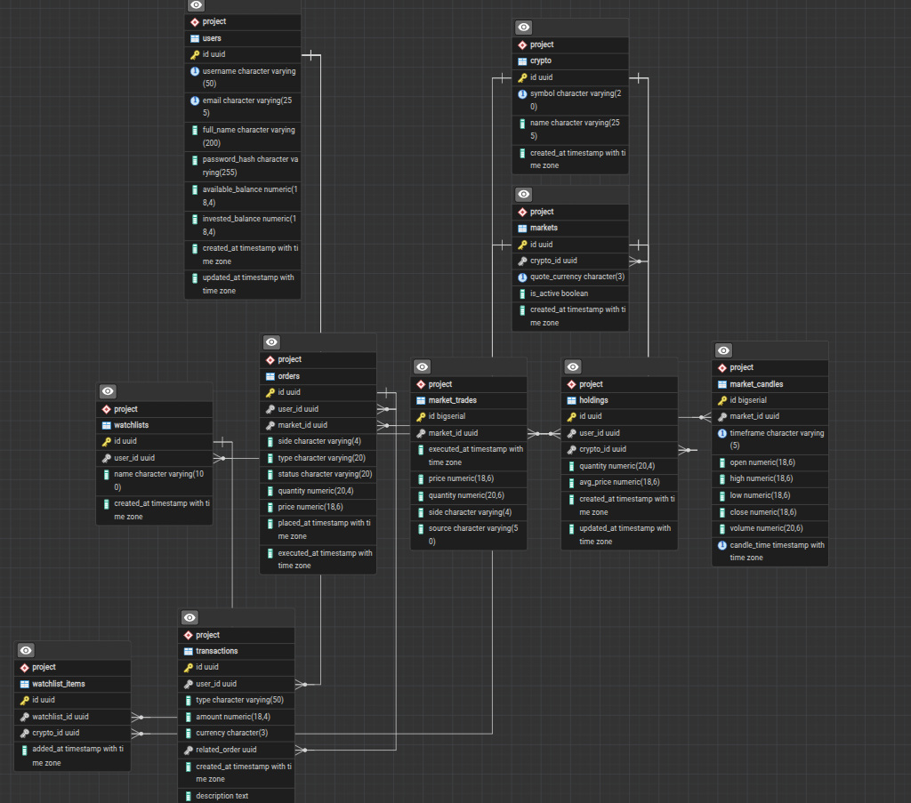

# Relational Design

## Descriptive representation of the relational schema

Notation: **bold** = primary key, *italic* = foreign key.

- **Users**(<u>**id**</u>, username, email, full_name, password_hash, available_balance, invested_balance, created_at, updated_at)
  - Candidate keys: `{id}`, `{username}`, `{email}`. `UNIQUE(username)`, `UNIQUE(email)`.
- **Crypto**(<u>**id**</u>, symbol, name, created_at)
  - Candidate keys: `{id}`, `{symbol}`. `UNIQUE(symbol)`.
- **Markets**(<u>**id**</u>, *crypto_id*, quote_currency, is_active, created_at)
  - Candidate keys: `{id}`, `{crypto_id, quote_currency}`. `UNIQUE(crypto_id, quote_currency)`.
- **Holdings**(<u>**id**</u>, *user_id*, *crypto_id*, quantity, reserved_quantity, avg_price, created_at, updated_at)
  - Transformation of the M:N relationship `Holds`. Candidate keys: `{id}` and
    `{user_id, crypto_id}` — the latter is the relationship's own key and is
    enforced with `UNIQUE(user_id, crypto_id)`. `id` was chosen as PK for
    consistency with the other relations.
  - `avg_price` is `NOT NULL DEFAULT 0 CHECK (avg_price >= 0)`.
  - `reserved_quantity` is `NOT NULL DEFAULT 0 CHECK (reserved_quantity >= 0
    AND reserved_quantity <= quantity)` — the amount already committed to the
    user's own open sell orders. `quantity - reserved_quantity` (the amount
    actually free to sell) is not a stored column; it is computed wherever
    needed, in `v_portfolio` as `available_quantity` and in the sell path of
    [UseCase0005](../P3-UseCaseModel/UseCase0005.md). See
    [ERModel](../P1-ConceptualModel/ERModel.md#holds--users-m--cryptos-n-partial-on-both-sides-with-attributes)
    for why this mirrors `available_balance`/`invested_balance` on `Users`.
- **Orders**(<u>**id**</u>, *user_id*, *market_id*, side, type, status, quantity, price, placed_at, executed_at)
  - `side ∈ {buy, sell}`, `type ∈ {market, limit}`, `status ∈ {open, executed, cancelled}`.
- **Transactions**(<u>**id**</u>, *user_id*, type, amount, currency, *related_order*, created_at, description)
  - `type ∈ {deposit, buy, sell, fee}`.
- **MarketTrades**(<u>**id**</u>, *market_id*, executed_at, price, quantity, side, source)
- **MarketCandles**(<u>**id**</u>, *market_id*, timeframe, open, high, low, close, volume, candle_time)
  - `UNIQUE(market_id, timeframe, candle_time)`.
- **Watchlists**(<u>**id**</u>, *user_id*, name, created_at)
- **WatchlistItems**(<u>**id**</u>, *watchlist_id*, *crypto_id*, added_at)
  - Transformation of the M:N relationship `Contains`. Candidate keys: `{id}`
    and `{watchlist_id, crypto_id}`, the latter enforced with
    `UNIQUE(watchlist_id, crypto_id)`.

### Transformation method used

**Partial transformation.** Applied as follows:

- Each of the 8 entity sets in [ERModel](../P1-ConceptualModel/ERModel.md) becomes one table, keeping
  its UUID (or serial) primary key.
- Each **1:N relationship without attributes** is transformed by adding the
  parent's primary key as a foreign-key column on the child table — the "N"
  side. This is where every foreign key in the schema comes from, and it is why
  no foreign keys appear in the ER diagram itself:
  `QuotedOn` → `markets.crypto_id`, `PlacedOn` → `orders.market_id`,
  `Places` → `orders.user_id`, `Records` → `transactions.user_id`,
  `Settles` → `transactions.related_order`, `Fills` → `market_trades.market_id`,
  `Aggregates` → `market_candles.market_id`, `Owns` → `watchlists.user_id`.
- Each **M:N relationship** becomes its own table holding the two foreign keys
  plus the relationship's own attributes: `Holds` → `holdings`,
  `Contains` → `watchlist_items`. The pair of foreign keys is the relationship's
  key and is enforced as a `UNIQUE` constraint in both tables.
- **Total participation** in the ER model becomes `NOT NULL` on the
  corresponding foreign key; partial participation stays nullable. `Settles` is
  partial on both sides, which is exactly why `transactions.related_order` is
  the one nullable foreign key in the schema — a deposit has no originating
  order.

### Normalisation

> **Validated in P5.** [Normalization](../P5-Normalization/Normalization.md) derives this
> exact schema independently — starting only from a single de-normalized relation of every
> model attribute and its functional dependencies, with no reference to the ER-to-relational
> transformation below — and shows it decomposes to **BCNF**, one normal form stronger than
> the 3NF claimed here. The two designs agree relation for relation and key for key, so
> nothing here changed as a result; see that page's
> [discussion](../P5-Normalization/Normalization.md#discussion) for what the one real
> difference is (`avg_price`, a stored derived value, not a normalisation issue) and why this
> design is still the one used from P5 onward.

All relations are in **3NF**:

- Every attribute is atomic (no repeating groups, no composite fields).
- No partial dependency exists because every primary key is a single UUID column.
- No transitive dependency exists: every non-key attribute depends directly on the row identifier. For example, `holdings.quantity` depends on `holdings.id`, not on `user_id` via some intermediate.
- `avg_price` in `Holdings` is a **derived value** cached for performance (it is
  the weighted-average entry price across all `buy` transactions for that
  `(user, crypto)` pair) — it is drawn as a derived attribute in the ER diagram.
  We accept the denormalisation: it is recomputed by the database inside the same
  transaction as each buy, in the same statement that changes the quantity
  (`INSERT … ON CONFLICT (user_id, crypto_id) DO UPDATE`), so the stored average
  and the stored quantity can never disagree.
- `avg_price` is declared `NOT NULL DEFAULT 0`. This matters: it is used in the
  P/L arithmetic of `v_portfolio`, and in SQL any arithmetic involving `NULL`
  yields `NULL`, so a nullable average would have silently blanked the
  unrealised-P/L column for an existing position instead of failing loudly.
- `holdings.reserved_quantity`, unlike `avg_price`, is **not** derived — it is
  written directly by the application (`trade.go`) as orders are placed and
  settled, the same way `quantity` itself is. `quantity - reserved_quantity`
  ("available") is the derived value here, and it is never stored, only
  computed where it is needed.

### Reservation and the order lifecycle

`holdings.reserved_quantity` exists so that placing a sell order can be
checked against what a user actually has *free* to sell
(`quantity - reserved_quantity`), not against the raw `quantity`, which also
counts crypto already promised to another order that has not settled yet.
`CHECK (reserved_quantity >= 0 AND reserved_quantity <= quantity)` makes an
inconsistent reservation impossible at the database level, regardless of what
application code does. The exact statement sequence — lock the row, check the
available amount, reserve, then settle — is in
[UseCase0005](../P3-UseCaseModel/UseCase0005.md); the same
`SELECT … FOR UPDATE` locking that already protected `users.available_balance`
on the buy path is what makes two concurrent sell orders against the same
holding serialize correctly instead of racing.

## DDL script

The script that creates the entire schema is [`../server/db/schema_creation.sql`](../../server/db/schema_creation.sql). It is idempotent: it drops and recreates the `project` schema every run, so it works on an empty database and on a database that already has the schema.

The script creates:
- 10 tables with check constraints, primary keys, foreign keys and unique constraints.
- 5 performance indexes.
- 2 views: `v_latest_prices` (latest trade price per market) and `v_portfolio` (per-user holdings valuation with unrealised P/L, plus `reserved_quantity` and the derived `available_quantity`).

## DML script (sample data)

The script that loads realistic sample data is [`../server/db/data_load.sql`](../../server/db/data_load.sql). It is idempotent: it truncates all tables with `CASCADE` then re-inserts. Loaded:
- 5 crypto assets (BTC, ETH, ADA, SOL, DOGE) and 5 USD-quoted markets.
- 3 sample users (`alice`, `bob`, `charlie`) with password `test123` (sha256 hex).
- 18 recent market trades across all markets so `v_latest_prices` is populated.
- 10 one-hour candles (BTC and ETH).
- One fully-executed market-buy order for Alice, the matching holding, and two ledger entries (deposit + buy), with Alice's balances updated accordingly.
- Two watchlists with five watchlist items.

## Relational diagram

Generated in **Pgadmin** from the **live** `project` schema, in crow's-foot
notation — not drawn by hand, so it is evidence that the deployed database
actually matches the design described above. Each box is a table with its
columns and declared types; key icons mark primary keys and the arrowed lines
are the 12 declared foreign keys.

### How to regenerate it

**With pgAdmin 4**, if DBeaver is unavailable — it reads the live schema the same
way, so the result is equivalent in substance:

1. Connect to the project database.
2. Right-click the database → **ERD For Database** (or open a blank ERD and drag
   the `project` tables in).
3. Arrange the tables to mirror `ERModel_v03.png`.
4. **Download image** → PNG, then convert:
   `convert relational_schema.png relational_schema.jpg`

