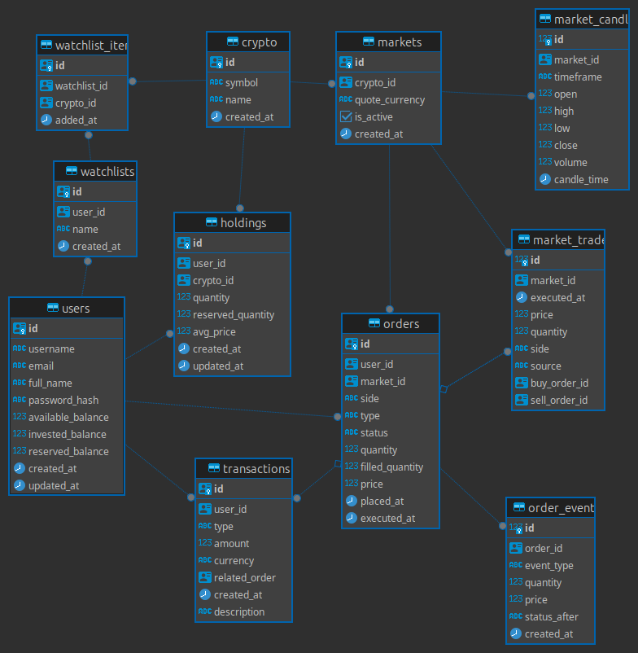

# Relational Design

This page transforms [ERModel](../P1-ConceptualModel/ERModel.md) **v05** into
relations. Every relation below corresponds to exactly one entity set of the
model, and every foreign key corresponds to exactly one relationship, so the
two diagrams can be compared box for box and line for line (see
[Relational diagram](#relational-diagram)).

## Descriptive representation of the relational schema

Notation: **bold** = primary key, *italic* = foreign key. After each foreign key
comes the ER relationship it implements.

- **Users**(<u>**id**</u>, username, email, full_name, password_hash, available_balance, invested_balance, reserved_balance, created_at, updated_at)
  - Entity set `Users`. Candidate keys: `{id}`, `{username}`, `{email}`. `UNIQUE(username)`, `UNIQUE(email)`.
- **Crypto**(<u>**id**</u>, symbol, name, created_at)
  - Entity set `Cryptos`. Candidate keys: `{id}`, `{symbol}`. `UNIQUE(symbol)`.
- **Markets**(<u>**id**</u>, *crypto_id* [`QuotedOn`], quote_currency, is_active, created_at)
  - Entity set `Markets`. Candidate keys: `{id}`, `{crypto_id, quote_currency}`
    (the model's rule "a crypto is quoted at most once per currency"),
    enforced with `UNIQUE(crypto_id, quote_currency)`.
- **Holdings**(<u>**id**</u>, *user_id* [`Holds`], *crypto_id* [`PositionIn`], quantity, reserved_quantity, avg_price, created_at, updated_at)
  - Entity set `Holdings`. Candidate keys: `{id}` and `{user_id, crypto_id}`
    (the model's rule "one holding per user and crypto"), enforced with
    `UNIQUE(user_id, crypto_id)`.
  - `avg_price` is `NOT NULL DEFAULT 0 CHECK (avg_price >= 0)`.
  - `reserved_quantity` is `NOT NULL DEFAULT 0 CHECK (reserved_quantity >= 0
    AND reserved_quantity <= quantity)` — the amount already committed to the
    user's own open sell orders. `quantity - reserved_quantity` (the amount
    actually free to sell) is not a stored column; it is computed wherever
    needed, in `v_portfolio` as `available_quantity` and in the sell path of
    [UseCase0005](../P3-UseCaseModel/UseCase0005.md). See
    [ERModel](../P1-ConceptualModel/ERModel.md#holdings)
    for why this mirrors `available_balance`/`invested_balance` on `Users`.
- **Orders**(<u>**id**</u>, *user_id* [`Places`], *market_id* [`PlacedOn`], side, type, status, quantity, filled_quantity, price, placed_at, executed_at)
  - Entity set `Orders`. `side ∈ {buy, sell}`, `type ∈ {market, limit}`,
    `status ∈ {open, partially_filled, executed, cancelled}`,
    `0 ≤ filled_quantity ≤ quantity`.
- **Transactions**(<u>**id**</u>, *user_id* [`Records`], type, amount, currency, *related_order* [`Settles`], created_at, description)
  - Entity set `Transactions`. `type ∈ {deposit, buy, sell, fee}`.
    `related_order` is nullable (see below).
- **MarketTrades**(<u>**id**</u>, *market_id* [`Fills`], executed_at, price, quantity, side, source, *buy_order_id* [`FillsBuy`], *sell_order_id* [`FillsSell`])
  - Entity set `MarketTrades`. `buy_order_id` and `sell_order_id` are both
    nullable (see below).
- **OrderEvents**(<u>**id**</u>, *order_id* [`Logs`], event_type, quantity, price, status_after, created_at)
  - Entity set `OrderEvents`. `event_type ∈ {placed, partially_filled, filled, cancelled}`.
- **MarketCandles**(<u>**id**</u>, *market_id* [`Aggregates`], timeframe, open, high, low, close, volume, candle_time)
  - Entity set `MarketCandles`. Candidate keys: `{id}`, `{market_id, timeframe,
    candle_time}` (the model's rule "one candle per market, timeframe and
    bucket"), enforced with `UNIQUE(market_id, timeframe, candle_time)`.
- **Watchlists**(<u>**id**</u>, *user_id* [`Owns`], name, created_at)
  - Entity set `Watchlists`.
- **WatchlistItems**(<u>**id**</u>, *watchlist_id* [`Contains`], *crypto_id* [`Lists`], added_at)
  - Entity set `WatchlistItems`. Candidate keys: `{id}` and `{watchlist_id,
    crypto_id}` (the model's rule "an asset at most once per list"), enforced
    with `UNIQUE(watchlist_id, crypto_id)`.

### Transformation method used

**Partial transformation.** The model has 11 entity sets and 15 relationships.
Every relationship is binary and 1:N with no attributes of its own (the two M:N
relationships of earlier versions, `Holds` and `Contains`, were corrected into
the entity sets `Holdings` and `WatchlistItems` in v05). The rules:

- **Each entity set becomes one relation**, with its own attributes and its
  own key `id` as primary key. 11 entity sets → 11 relations.
- **Each 1:N relationship becomes one foreign key** on the relation of the "N"
  side, pointing to the primary key of the "1" side. No relationship gets its
  own table, because none is M:N and none has attributes. 15 relationships →
  15 foreign keys:

  | ER relationship | 1 side → N side | Foreign key | Participation of the N side | `NULL`? |
  |---|---|---|---|---|
  | `QuotedOn`   | Cryptos → Markets             | `markets.crypto_id`            | total   | `NOT NULL` |
  | `PlacedOn`   | Markets → Orders              | `orders.market_id`             | total   | `NOT NULL` |
  | `Places`     | Users → Orders                | `orders.user_id`               | total   | `NOT NULL` |
  | `Records`    | Users → Transactions          | `transactions.user_id`         | total   | `NOT NULL` |
  | `Settles`    | Orders → Transactions         | `transactions.related_order`   | partial | nullable |
  | `Fills`      | Markets → MarketTrades        | `market_trades.market_id`      | total   | `NOT NULL` |
  | `FillsBuy`   | Orders → MarketTrades         | `market_trades.buy_order_id`   | partial | nullable |
  | `FillsSell`  | Orders → MarketTrades         | `market_trades.sell_order_id`  | partial | nullable |
  | `Logs`       | Orders → OrderEvents          | `order_events.order_id`        | total   | `NOT NULL` |
  | `Aggregates` | Markets → MarketCandles       | `market_candles.market_id`     | total   | `NOT NULL` |
  | `Owns`       | Users → Watchlists            | `watchlists.user_id`           | total   | `NOT NULL` |
  | `Holds`      | Users → Holdings              | `holdings.user_id`             | total   | `NOT NULL` |
  | `PositionIn` | Cryptos → Holdings            | `holdings.crypto_id`           | total   | `NOT NULL` |
  | `Contains`   | Watchlists → WatchlistItems   | `watchlist_items.watchlist_id` | total   | `NOT NULL` |
  | `Lists`      | Cryptos → WatchlistItems      | `watchlist_items.crypto_id`    | total   | `NOT NULL` |

- **Participation decides `NULL`.** Total participation of the N side means
  every row must reference a parent, so the foreign key is `NOT NULL`. Partial
  participation leaves it nullable. There are exactly three partial ones:
  `Settles` (a deposit has no originating order), and `FillsBuy` / `FillsSell`
  (a trade against the simulated market has no user order on that side).
  Partial participation of the **1** side (for example, a user with no orders)
  needs no column at all. It simply means no row points at that parent.
- **Uniqueness rules of the model become `UNIQUE` constraints.** The four
  rules the model states in words ("a crypto quoted once per currency", "one
  candle per market, timeframe and bucket", "one holding per user and crypto",
  "an asset once per list") involve a relationship, so Chen notation cannot
  draw them as keys. After transformation, the relationship is a foreign-key
  column, and each rule becomes an ordinary composite `UNIQUE` constraint, i.e. a
  second candidate key.

Nothing in the schema comes from anywhere else. Every column is either an ER
attribute or the foreign key of one listed relationship.

### Normalisation

> **Checked in P5.** [Normalization](../P5-Normalization/Normalization.md)
> starts from a single de-normalized relation containing only the attributes
> of the ER model and the functional dependencies that follow from its rules.
> It decomposes that relation step by step to BCNF and arrives at these same 11
> relations, with one deliberate difference: `transactions.user_id` (see the last
> bullet below). The comparison is in the *Discussion* section at the end of that
> page.

All relations except `transactions` are in **BCNF**, as P5 shows. `transactions`
is in 2NF but not in 3NF, because of the deliberately kept `user_id` (last
bullet):

- Every attribute is atomic (no repeating groups, no composite fields).
- No partial dependency exists: every candidate key is either the single
  column `id` or a composite key (`{user_id, crypto_id}`, …) on which no
  non-key attribute depends only partially.
- No transitive dependency exists, except `transactions.user_id` (last bullet):
  every other non-key attribute depends directly on the row's own entity, never
  on another entity reached through a foreign key.
  For example, `holdings.quantity` depends on `holdings.id`, and nothing about
  the user or the crypto is copied into `holdings`.
- `avg_price` in `Holdings` is a **derived value** cached for performance (it is
  the weighted-average entry price across all `buy` transactions for that
  `(user, crypto)` pair) — it is drawn as a derived attribute in the ER diagram.
  We accept the denormalisation: it is recomputed by the database inside the same
  transaction as each buy, in the same statement that changes the quantity
  (`INSERT … ON CONFLICT (user_id, crypto_id) DO UPDATE`), so the stored average
  and the stored quantity can never disagree.
- `avg_price` is declared `NOT NULL DEFAULT 0`. This matters: it is used in the
  P/L arithmetic of `v_portfolio`, and in SQL any arithmetic involving `NULL`
  yields `NULL`, so a nullable average would have silently blanked the
  unrealised-P/L column for an existing position instead of failing loudly.
- `holdings.reserved_quantity`, unlike `avg_price`, is **not** derived — it is
  written directly by the application (`trade.go`) as orders are placed and
  settled, the same way `quantity` itself is. `quantity - reserved_quantity`
  ("available") is the derived value here, and it is never stored, only
  computed where it is needed.
- `transactions.user_id` is kept **deliberately**, although for an entry that
  settles an order it repeats that order's user (`related_order → user_id`, a
  transitive dependency). A deposit has no order (`Settles` is partial), so
  `user_id` is the only way to record whose deposit it is. For entries with an
  order, the only code that sets `related_order` (the buy and sell inserts in
  `advanced_db.sql`) writes both from the same order row. No database
  constraint enforces this.

### Reservation and the order lifecycle

`holdings.reserved_quantity` exists so that placing a sell order can be
checked against what a user actually has *free* to sell
(`quantity - reserved_quantity`), not against the raw `quantity`, which also
counts crypto already promised to another order that has not settled yet.
`CHECK (reserved_quantity >= 0 AND reserved_quantity <= quantity)` makes an
inconsistent reservation impossible at the database level, regardless of what
application code does. The exact statement sequence — lock the row, check the
available amount, reserve, then settle — is in
[UseCase0005](../P3-UseCaseModel/UseCase0005.md); the same
`SELECT … FOR UPDATE` locking that already protected `users.available_balance`
on the buy path is what makes two concurrent sell orders against the same
holding serialize correctly instead of racing. The cash side of a buy order
(`users.reserved_balance`), `orders.filled_quantity` and `order_events` were
added in P7; see
[AdvancedDatabaseDevelopment](../P7-AdvancedDatabaseDevelopment/AdvancedDatabaseDevelopment.md).

## DDL script

The script that creates the schema is [`../server/db/schema_creation.sql`](../../server/db/schema_creation.sql). It is idempotent: it drops and recreates the `project` schema every run, so it works on an empty database and on a database that already has the schema.

The script creates:
- 10 of the 11 tables, with check constraints, primary keys, foreign keys and unique constraints.
- 8 performance indexes.
- 2 views: `v_latest_prices` (latest trade price per market) and `v_portfolio` (per-user holdings valuation with unrealised P/L, plus `reserved_quantity` and the derived `available_quantity`).

The 11th table, `order_events`, is created by
[`../server/db/advanced_db.sql`](../../server/db/advanced_db.sql) together with
the P7 triggers that fill it. `./eduberza -init` runs both scripts in that
order, so a freshly initialised database always has all 11 tables and all 15
foreign keys.

## DML script (sample data)

The script that loads realistic sample data is [`../server/db/data_load.sql`](../../server/db/data_load.sql). It is idempotent: it truncates all tables with `CASCADE` then re-inserts. Loaded:
- 5 crypto assets (BTC, ETH, ADA, SOL, DOGE) and 5 USD-quoted markets.
- 3 sample users (`alice`, `bob`, `charlie`) with password `test123` (sha256 hex).
- 18 recent market trades across all markets so `v_latest_prices` is populated.
- 10 one-hour candles (BTC and ETH).
- One fully-executed market-buy order for Alice, the matching holding, and two ledger entries (deposit + buy), with Alice's balances updated accordingly.
- Two watchlists with five watchlist items.

## Relational diagram



Generated in **DBeaver** from the **live** `project` schema (after
`./eduberza -init`), not drawn by hand, so it shows what the deployed database
actually contains. Each box is a table with its columns; the key icon marks the
primary key, and the lines are the 15 declared foreign keys. The two foreign keys from
`market_trades` to `orders` (`buy_order_id`, `sell_order_id`) connect the same
two boxes, so DBeaver draws them on top of each other as one line.

The tables are arranged in the **same positions** as the entity sets in
`ERModel_v05.png`, so the two can be compared directly:

- every rectangle of the ER diagram is one table in the same place;
- every diamond of the ER diagram is one foreign-key line between the same two
  boxes. The dot is on the referencing ("N") table, next to the foreign-key
  column;
- a double (total) line in the ER diagram is a `NOT NULL` foreign key, drawn by
  DBeaver as a solid line. The three single lines on the N side (`Settles`,
  `FillsBuy`, `FillsSell`) are the three nullable foreign keys, which DBeaver
  draws dashed, with a hollow diamond on the `orders` side. The table under
  [Transformation method used](#transformation-method-used) lists all 15.

Earlier images (`relational_schema.jpg`, `relational_schema_v2.png`,
`relational_schema_v3.png`) were exported from pgAdmin, with a different layout
and from an older schema. They are kept only as history.

### How to regenerate it

1. Initialise the database: `./eduberza -init` (runs `schema_creation.sql` and
   `advanced_db.sql`, so `order_events` is included).
2. In DBeaver, connect to the project database and expand
   *Schemas → project → Tables*.
3. Select all 11 tables → right-click → **View Diagram** (or create a new ER
   diagram and drag the tables in).
4. Drag each table to the position of its entity set in `ERModel_v05.png`:

   ```
            column 1          column 2        column 3        column 4
   row 1    watchlist_items   crypto          markets         market_candles
   row 2    watchlists        holdings        .               market_trades
   row 3    users             .               orders          .
   row 4    .                 transactions    order_events    .
   ```

   Leave the empty cells (`.`) empty. They are where the relationship
   diamonds are in the ER diagram, so the foreign-key lines will run through
   the same gaps.

5. Right-click the canvas → **Export diagram** → PNG, saved as
   `relational_diagram_v4.png` in this folder.
