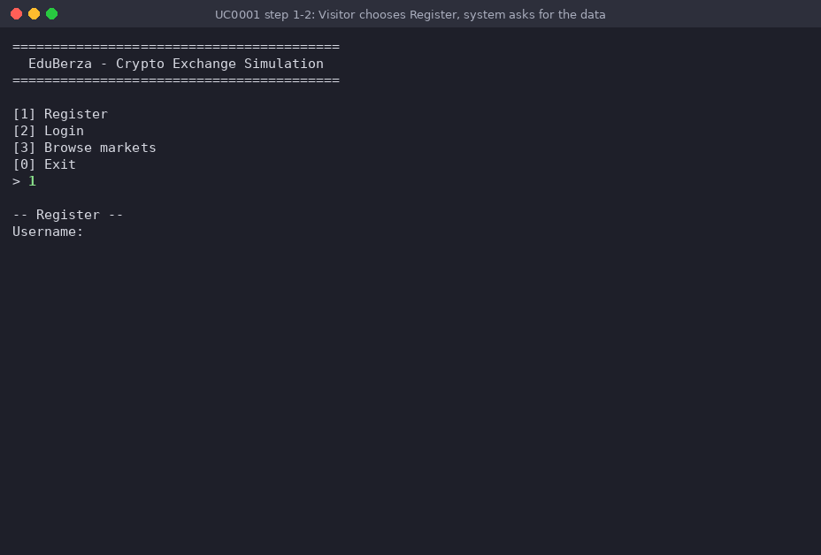
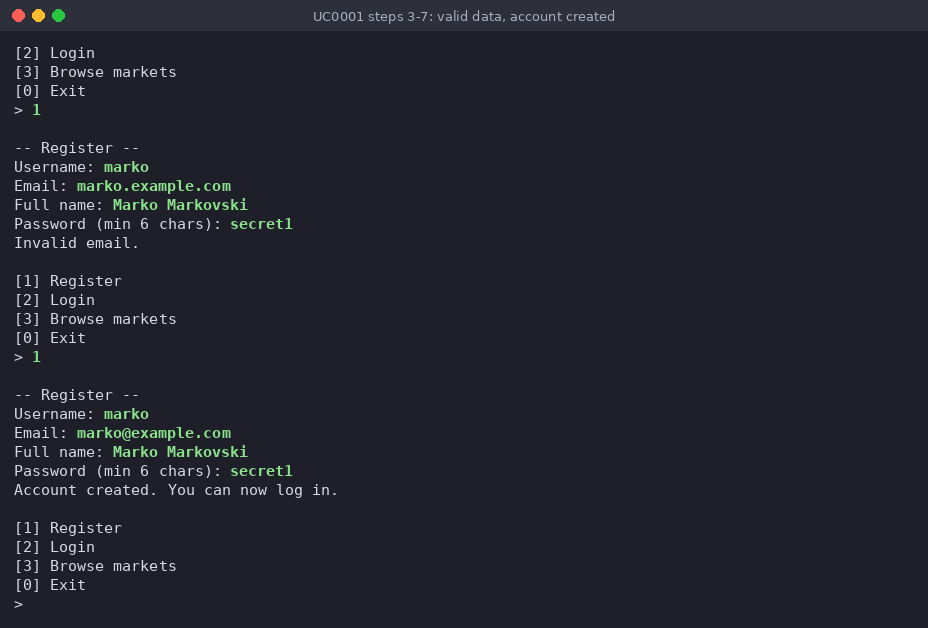
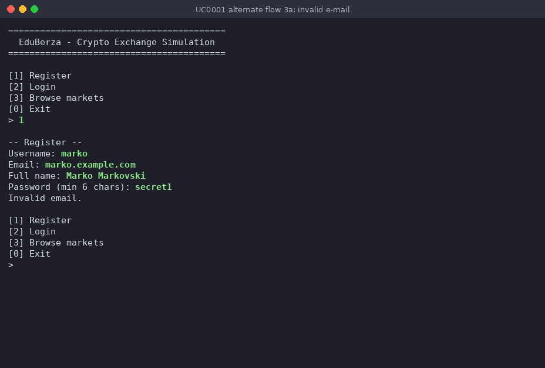
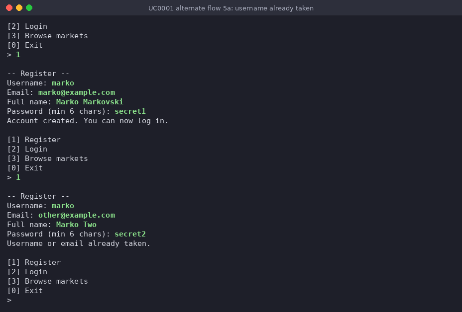

# Use-case 0001 Implementation - Register new account

**Initiating actor:** Visitor

**Other actors:** —

A new person creates an account on EduBerza so that they can later log in as a
Trader ([UseCase0002](UseCase0002Implementation.md)). The Visitor enters a
username, an e-mail address, a full name and a password. The system validates the
input (required fields, an `@` in the e-mail, a password of at least 6 characters),
refuses a username or e-mail that is already registered, and stores only a SHA-256
hash of the password, never the password itself. A new account starts with a cash
balance of 0 USD; money is added later with a deposit
([UseCase0003](UseCase0003Implementation.md)).

Original use-case description (P3): [UseCase0001](../P3-UseCaseModel/UseCase0001.md).
Implementation: [`server/auth.go`](../../server/auth.go), function `Register`
(the password hash is computed by `hashPassword` in the same file).

## Scenario

1. **Visitor** chooses `[1] Register` in the anonymous menu (types `1`).
2. **System** prints `-- Register --` and asks, one prompt after another, for
   `Username:`, `Email:`, `Full name:` and `Password (min 6 chars):`.

   The screenshot shows steps 1–2: option `1` is chosen and the first prompt
   (`Username:`) is waiting for input.

   

3. **Visitor** enters the values: `marko`, `marko@example.com`, `Marko Markovski`,
   `secret1`.
4. **System** validates the input in Go, without accessing the database:
   - username, e-mail and password must be non-empty, otherwise it prints
     `Username, email and password are required.` and the scenario ends;
   - the e-mail must contain `@` (see alternate flow 3a);
   - the password must be at least 6 characters long, otherwise it prints
     `Password must be at least 6 characters.` and the scenario ends.
5. **System** checks whether the username or the e-mail already exists
   (`$1` = username, `$2` = e-mail):

   ```sql
   SELECT EXISTS(SELECT 1 FROM users WHERE username = $1 OR email = $2)
   ```

   If the result is `true`, alternate flow 5a applies.
6. **System** creates the account (`$1` = username, `$2` = e-mail, `$3` = full name,
   `$4` = password hash). The hash is computed in Go by `hashPassword` as the
   hex-encoded SHA-256 of the password — the same value that P3's
   `encode(digest($4, 'sha256'), 'hex')` would produce in SQL. Hashing on the Go side
   keeps it identical to the check done at login (SQL as in the code, only the Go
   source indentation removed):

   ```sql
   INSERT INTO users (username, email, full_name, password_hash, available_balance)
   VALUES ($1, $2, $3, $4, 0)
   ```

7. **System** prints `Account created. You can now log in.` and returns to the
   anonymous menu; the Visitor can continue with
   [UseCase0002](UseCase0002Implementation.md).

   The screenshot shows steps 3–7 of the successful attempt (bottom half): the
   entered values, the confirmation and the anonymous menu again. The top half is the
   earlier rejected attempt from alternate flow 3a.

   

All statements are run on the `project` schema: the connection sets
`search_path=project,public` (`server/db/db.go`), so `users` means `project.users`.

### Alternate flow 3a — invalid e-mail

In step 3 the Visitor entered `marko.example.com` (no `@`). The check in step 4
fails, the system prints `Invalid email.` and no SQL statement is executed. In the
prototype the system then shows the anonymous menu again and the Visitor chooses
`[1] Register` once more, which returns the scenario to step 2.



### Alternate flow 5a — duplicate username or e-mail

After `marko` has been created, the Visitor tries to register again with username
`marko`, e-mail `other@example.com`, full name `Marko Two`, password `secret2`. The
query from step 5 (`$1` = `marko`, `$2` = `other@example.com`) returns `true`
because the username is taken, so the system prints
`Username or email already taken.`, does not run the `INSERT`, and the scenario
ends in the anonymous menu.



## How to reproduce

```sh
./eduberza -init      # optional: reset to a known state
./eduberza
# [1] Register: marko / marko.example.com / Marko Markovski / secret1  -> Invalid email.
# [1] Register: marko / marko@example.com / Marko Markovski / secret1  -> Account created.
# [1] Register: marko / other@example.com / Marko Two / secret2        -> Username or email already taken.
```

All three screenshots come from one real run of exactly these inputs.
