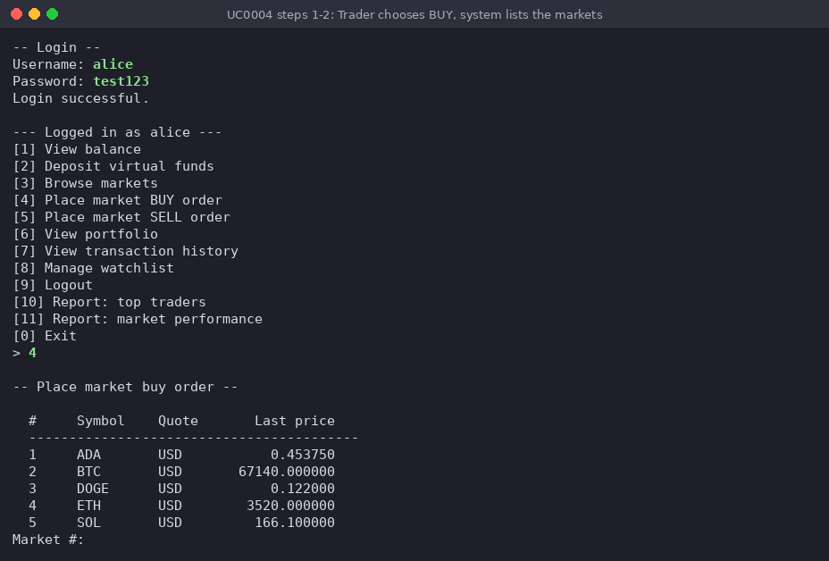
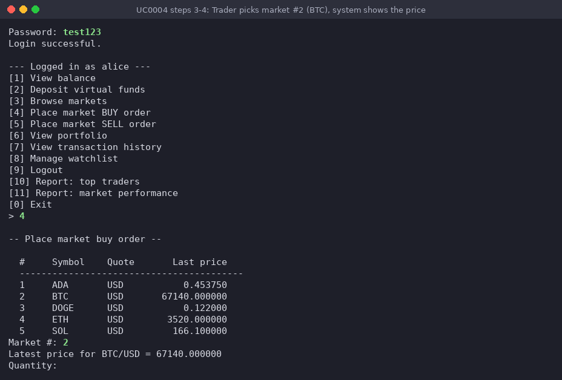
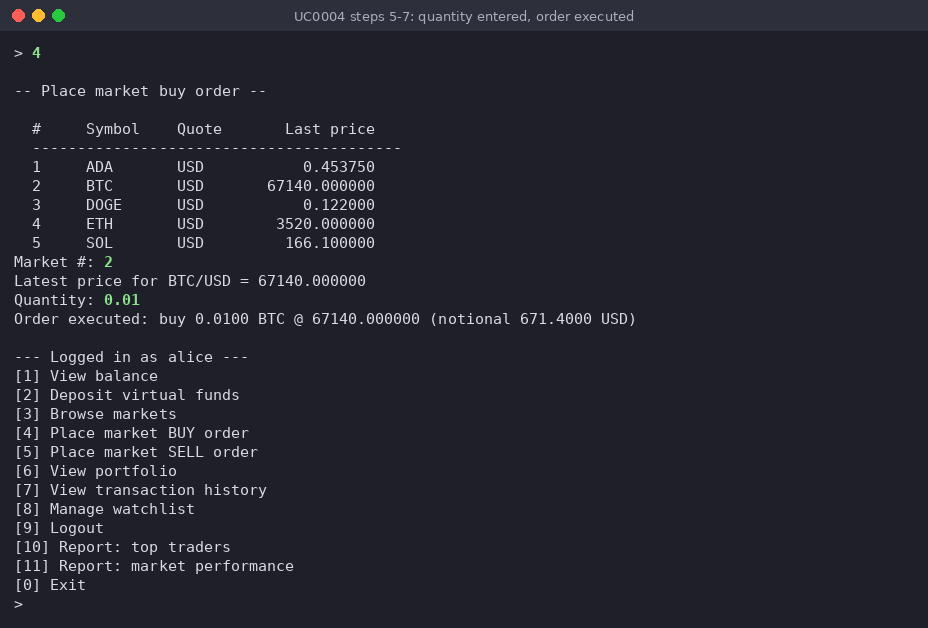
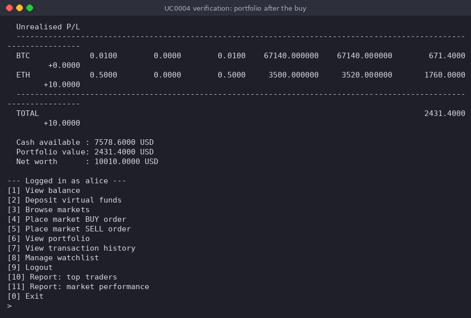
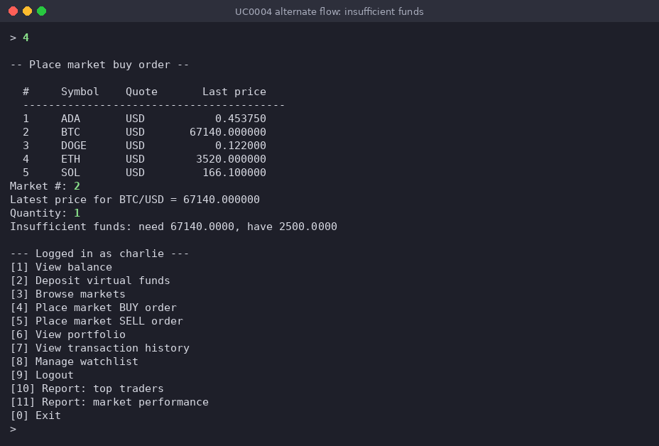

# Use-case 0004 Implementation - Place market BUY order

**Initiating actor:** Trader

**Other actors:** Market Simulator (indirect — supplies the current price via `market_trades`).

A logged-in Trader buys a crypto asset at the current market price. The Trader never
types a symbol or an identifier: the system lists the active markets with their last
price, numbered, and the Trader picks one by its number and then enters only the
quantity. The system checks that the Trader has enough available cash for
quantity × price and then, in one database transaction, records the order, moves the
cash from available to invested, adds the crypto to the Trader's holding (recomputing
the weighted-average entry price), writes a ledger entry and a market trade, and marks
the order executed. The operation touches five tables (`orders`, `users`, `holdings`,
`transactions`, `market_trades`) and either all of it succeeds or all of it is rolled
back.

Original use-case description (P3): [UseCase0004](../P3-UseCaseModel/UseCase0004.md).
Implementation: [`server/trade.go`](../../server/trade.go), function
`PlaceOrder(s, "buy")` (with `upsertHoldingOnBuy` in the same file), which calls
`ChooseMarket`, `ListMarkets`, `pickNumber` and `LatestPrice` from
[`server/market.go`](../../server/market.go).

All statements run on the `project` schema: the connection sets
`search_path=project,public` (`server/db/db.go`), so `orders` means `project.orders`.
The SQL below is copied from the Go code; only the Go source indentation is removed,
a `;` is added after each statement of the transaction, and `--` comments say what
each `$n` placeholder is bound to.

The run shown is user `alice` on the seed data (available 8250.00 USD, holding
0.5 ETH bought at 3500), buying 0.01 BTC.

## Scenario

1. **Trader** chooses `[4] Place market BUY order` in the authenticated menu (types `4`).
2. **System** prints `-- Place market buy order --` and lists all active markets,
   numbered, with their last price (`ListMarkets`, called by `ChooseMarket`):

   ```sql
   SELECT m.id, c.id, c.symbol, m.quote_currency,
          COALESCE(lp.price, 0) AS price
     FROM markets m
     JOIN crypto  c  ON c.id = m.crypto_id
     LEFT JOIN v_latest_prices lp ON lp.market_id = m.id
    WHERE m.is_active = true
    ORDER BY c.symbol
   ```

   The rows are printed in this order as `1 ADA`, `2 BTC`, `3 DOGE`, `4 ETH`, `5 SOL`;
   Go keeps each row's market id and crypto id in memory, so the Trader only ever sees
   and types the list number. The system then asks `Market #:`.

   

3. **Trader** picks the market by its number in the list: `2` (BTC/USD).
4. **System** takes the market id and crypto id of row 2 from the list (no further
   lookup by symbol) and reads the latest price of that market (`LatestPrice`;
   `$1` = the chosen market's id):

   ```sql
   SELECT price FROM v_latest_prices WHERE market_id = $1
   ```

   It prints `Latest price for BTC/USD = 67140.000000` and asks `Quantity:`.

   

5. **Trader** enters the quantity `0.01`.
6. **System** computes in Go notional = quantity × price = 0.01 × 67140 = 671.40 and
   passes it to SQL as a parameter. It then runs one database transaction; the
   statements below are in exactly the order `PlaceOrder` executes them for a buy:

   ```sql
   BEGIN;

   -- (a) record the order as 'open' — no trade has happened yet.
   --     $1 = user id, $2 = market id, $3 = side (the Go variable side = 'buy'),
   --     $4 = quantity (0.01), $5 = price (67140); the returned id is kept in Go.
   INSERT INTO orders (user_id, market_id, side, type, status, quantity, price)
    VALUES ($1, $2, $3, 'market', 'open', $4, $5)
    RETURNING id;

   -- (b) lock the user's row and read the available cash. $1 = user id.
   --     Go compares it with the notional; if it is smaller -> alternate flow 6a.
   SELECT available_balance FROM users WHERE id = $1 FOR UPDATE;

   -- (c) move the notional from available to invested cash.
   --     $1 = notional (671.40), $2 = user id.
   UPDATE users
       SET available_balance = available_balance - $1,
           invested_balance  = invested_balance  + $1,
           updated_at        = now()
     WHERE id = $2;

   -- (d) add the crypto to the holding (upsertHoldingOnBuy), recomputing the
   --     weighted-average entry price in the database. Every SET expression sees
   --     the pre-update row, so holdings.quantity is still the old quantity.
   --     $1 = user id, $2 = crypto id, $3 = quantity (0.01), $4 = price (67140).
   INSERT INTO holdings (user_id, crypto_id, quantity, avg_price, updated_at)
    VALUES ($1, $2, $3, $4, now())
    ON CONFLICT (user_id, crypto_id) DO UPDATE
       SET avg_price  = (holdings.quantity * holdings.avg_price
                          + EXCLUDED.quantity * EXCLUDED.avg_price)
                        / (holdings.quantity + EXCLUDED.quantity),
           quantity   = holdings.quantity + EXCLUDED.quantity,
           updated_at = now();

   -- (e) ledger entry. $1 = user id, $2 = -notional (-671.40), $3 = order id from (a),
   --     $4 = description built in Go: 'Market buy 0.0100 BTC @ 67140.000000'.
   INSERT INTO transactions (user_id, type, amount, currency, related_order, description)
    VALUES ($1, 'buy', $2, 'USD', $3, $4);

   -- (f) record the resulting market trade.
   --     $1 = market id, $2 = price, $3 = quantity, $4 = side ('buy').
   INSERT INTO market_trades (market_id, executed_at, price, quantity, side, source)
    VALUES ($1, now(), $2, $3, $4, 'user');

   -- (g) settle the order itself — it has now actually been filled. $1 = order id.
   UPDATE orders SET status = 'executed', executed_at = now() WHERE id = $1;

   COMMIT;
   ```

   A buy never reserves crypto (only a sell does, see
   [UseCase0005](UseCase0005Implementation.md)), so `holdings.reserved_quantity` is not
   touched and stays 0.

7. **System** confirms
   `Order executed: buy 0.0100 BTC @ 67140.000000 (notional 671.4000 USD)` and shows
   the authenticated menu again.

   The screenshot shows steps 5–7: the entered quantity, the confirmation and the menu.

   

### Verification — portfolio after the buy

Right after the buy the Trader chooses `[6] View portfolio`
([UseCase0006](UseCase0006Implementation.md)). It shows the new holding
`BTC 0.0100` with average buy price and current price 67140.000000 (value 671.4000),
the unchanged `ETH 0.5000` (average 3500, current 3520, unrealised P/L +10.0000),
`Cash available : 7578.6000 USD` (= 8250.00 − 671.40), portfolio value 2431.4000 and
net worth 10010.0000 USD. The `Reserved` column is 0.0000 on both rows — a buy never
reserves anything.



### Alternate flow 6a — insufficient funds

User `charlie` (seed data: 2500.00 USD available, no crypto) chooses `[4]`, picks
market `2` (BTC, 67140.000000) and enters quantity `1`. Go computes the notional
67140.00. In the transaction, statement (a) inserts the `open` order and statement (b)
`SELECT available_balance FROM users WHERE id = $1 FOR UPDATE` returns 2500.00, which
is less than the notional. `PlaceOrder` prints
`Insufficient funds: need 67140.0000, have 2500.0000` and returns without running
(c)–(g); the deferred `tx.Rollback()` undoes statement (a), so no order, no ledger
entry and no balance change is left behind (after this run charlie has no row in
`orders` and still 2500.00 USD available). The authenticated menu is shown again.



### Alternate flow 3a — number not in the list

If in step 3 the Trader enters something that is not a number from 1 to the number of
listed markets, `pickNumber` prints `Invalid choice, enter a number from 1 to 5.`, no
further SQL is run and the authenticated menu is shown again (the same check is shown
in [UseCase0007](UseCase0007Implementation.md), alternate flow 12a). Likewise, a
quantity that is not a positive number in step 5 prints `Invalid quantity.` before any
transaction is opened.
