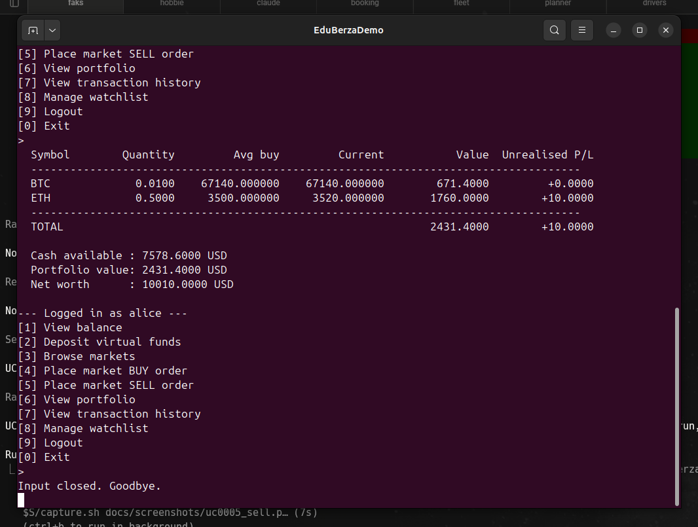

# Use-case 0004 Implementation — Buy

**Initiating actor:** Trader. **Source file:** `server/trade.go`, function `PlaceOrder(s, "buy")`.

## Scenario (implemented)

1. **User** chooses `[4] Place market BUY order`.
2. **System** lists markets with their latest price (same SQL as UC0006 — via the `v_latest_prices` view).


3. **User** enters `BTC`.
4. **System** resolves the market and fetches the latest price:

   ```sql
   SELECT m.id, c.id, c.symbol, m.quote_currency
     FROM markets m
     JOIN crypto c ON c.id = m.crypto_id
    WHERE upper(c.symbol) = upper($1) AND m.is_active;

   SELECT price FROM v_latest_prices WHERE market_id = $2;
   ```

5. **User** enters quantity `0.01`.
6. **System** executes a single database transaction — *all or nothing*:

   ```sql
   BEGIN;

   -- (a) record the order as 'open' — no trade has happened yet
   INSERT INTO orders
       (user_id, market_id, side, type, status, quantity, price)
   VALUES
       ($1, $2, 'buy', 'market', 'open', $3, $4)
   RETURNING id;

   -- (b) lock and check the user balance
   SELECT available_balance FROM users WHERE id = $1 FOR UPDATE;

   -- (c) move cash from available to invested. A buy never reserves crypto
   --     the way a sell does (see UC0005) — it only ever adds to the
   --     position, so there is nothing to commit on the holdings side
   --     before settling.
   UPDATE users
      SET available_balance = available_balance - $notional,
          invested_balance  = invested_balance  + $notional,
          updated_at        = now()
    WHERE id = $1;

   -- (d) upsert the holding, recomputing the weighted-average entry price
   --     in one statement. Every SET expression sees the pre-update row, so
   --     holdings.quantity below is still the old quantity.
   --     reserved_quantity is untouched by a buy and defaults to 0.
   INSERT INTO holdings (user_id, crypto_id, quantity, avg_price, updated_at)
   VALUES ($1, $c, $3, $4, now())
   ON CONFLICT (user_id, crypto_id) DO UPDATE
      SET avg_price  = (holdings.quantity * holdings.avg_price
                         + EXCLUDED.quantity * EXCLUDED.avg_price)
                       / (holdings.quantity + EXCLUDED.quantity),
          quantity   = holdings.quantity + EXCLUDED.quantity,
          updated_at = now();

   -- (e) ledger entry
   INSERT INTO transactions
       (user_id, type, amount, currency, related_order, description)
   VALUES
       ($1, 'buy', -$notional, 'USD', $orderId, 'Market buy ...');

   -- (f) record the resulting market trade
   INSERT INTO market_trades
       (market_id, executed_at, price, quantity, side, source)
   VALUES
       ($2, now(), $4, $3, 'buy', 'user');

   -- (g) settle the order itself — it has now actually been filled
   UPDATE orders SET status = 'executed', executed_at = now() WHERE id = $orderId;

   COMMIT;
   ```

7. **System** prints: `Order executed: buy 0.0100 BTC @ 67140.000000 (notional 671.4000 USD)`.

   

## Verified run (from actual prototype execution)

Re-run 2026-09-16 against PostgreSQL 16 (`bp_database` on `localhost:5433`) with freshly loaded seed data:

- **Before:** alice.available_balance = 8250.00, portfolio = { ETH: 0.5000, reserved 0.0000 }.
- **Command:** `buy 0.01 BTC`.
- **After:** alice.available_balance = 7578.60 (= 8250 − 671.40), portfolio = { BTC: 0.0100 @ 67140 (reserved 0.0000), ETH: 0.5000 @ 3500 (reserved 0.0000) }, net worth = 10010.00 USD (the +10 is the ETH unrealised P/L from the price moving from 3500 → 3520). A buy never sets `reserved_quantity`, so it reads 0 on every row here.

## Failure path — insufficient funds

If `available_balance < notional`, the `defer tx.Rollback()` in `server/trade.go` reverts every statement above and the user sees:

```
Insufficient funds: need X, have Y
```
