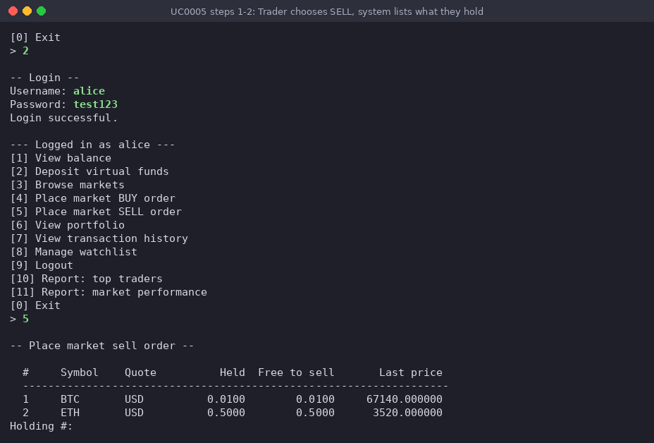
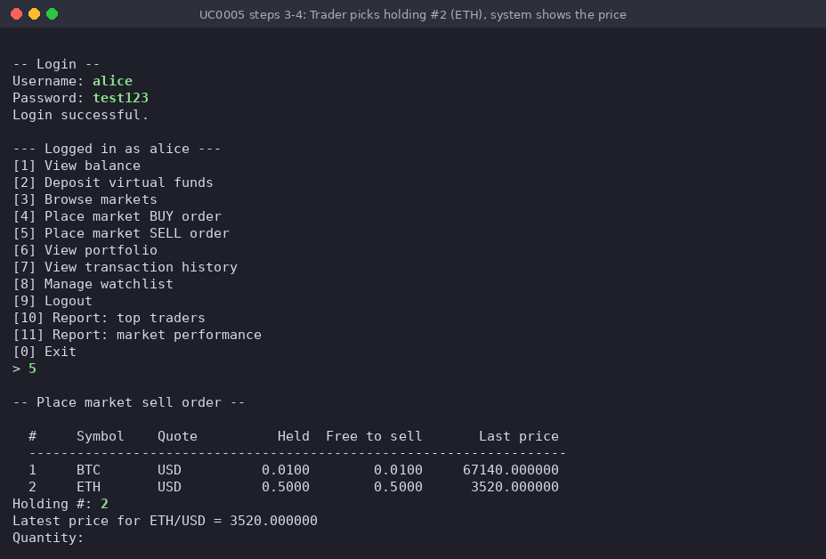
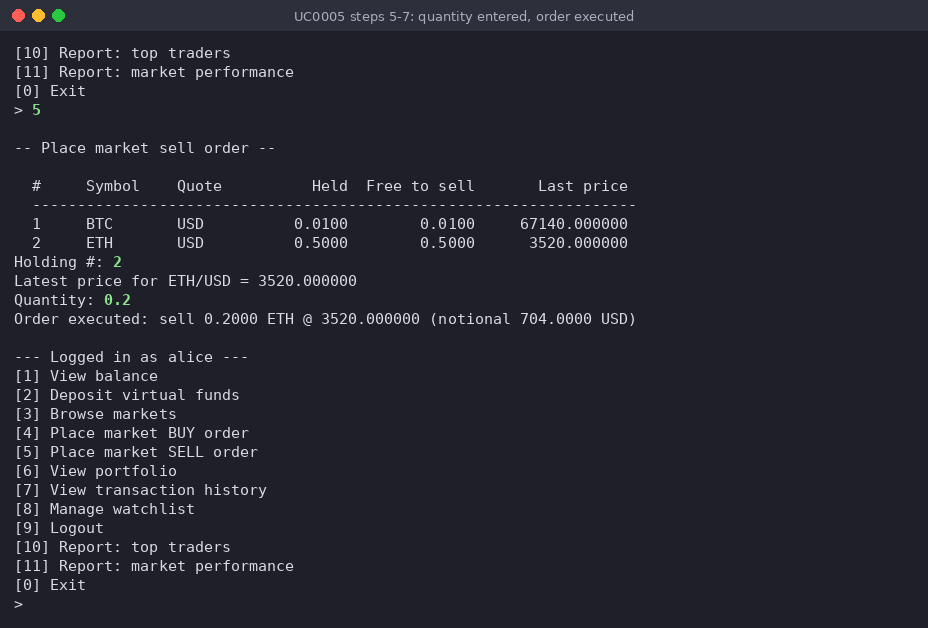
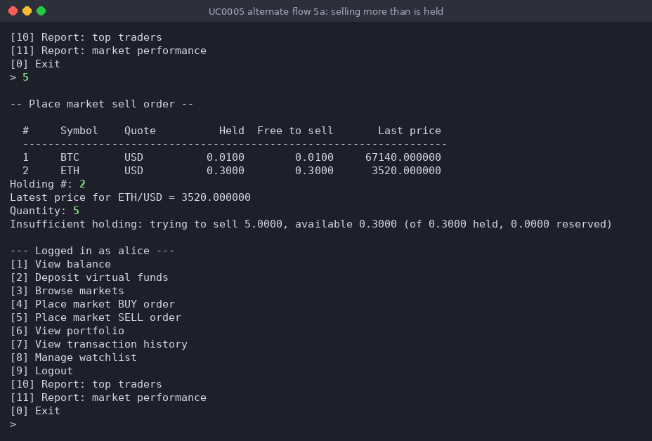

# Use-case 0005 Implementation - Place market SELL order

**Initiating actor:** Trader

**Other actors:** Market Simulator (indirect — supplies the current price).

A logged-in Trader sells part or all of a holding at the current market price. The
Trader never types a symbol: the system lists only the cryptos the Trader holds and can
still sell (the quantity not already reserved by an open sell order), numbered, with
how much is held and how much is free, and the Trader picks one by its number and
enters the quantity. In one database transaction the system records the order,
reserves the crypto being sold and settles it, credits the proceeds to the Trader's
available cash while reducing the invested cash by the cost basis, writes a ledger
entry and a market trade, and marks the order executed. Cost basis is preserved, so
the realised P/L can be reconstructed from the ledger.

Original use-case description (P3): [UseCase0005](../P3-UseCaseModel/UseCase0005.md).
Implementation: [`server/trade.go`](../../server/trade.go), function
`PlaceOrder(s, "sell")`, which calls `ChooseHolding`, `pickNumber` and `LatestPrice`
from [`server/market.go`](../../server/market.go).

All statements run on the `project` schema (the connection sets
`search_path=project,public` in `server/db/db.go`). The SQL below is copied from the
Go code; only the Go source indentation is removed, a `;` is added after each
statement of the transaction, and `--` comments say what each `$n` placeholder is
bound to.

The run shown is user `alice` right after the buy of
[UseCase0004](UseCase0004Implementation.md): 7578.60 USD available, holdings
0.01 BTC (bought at 67140) and 0.5 ETH (bought at 3500). She sells 0.2 ETH.

## Reserve, then settle

The crypto being sold is **reserved** (`holdings.reserved_quantity`) before it is
removed from the position, and the sell check is against what is truly still free,
`quantity - reserved_quantity`, not against the raw `quantity`, which would also count
crypto already promised to another order. Because only market orders are implemented,
an order settles in the same transaction it is placed in, so reserve and settle are two
statements inside one commit; they stay logically distinct so that a future
limit-order matcher, where an order would stay `open` until a *later* transaction fills
it, needs a second transaction but no schema change.

## Scenario

1. **Trader** chooses `[5] Place market SELL order` in the authenticated menu (types `5`).
2. **System** prints `-- Place market sell order --` and lists, numbered, only the
   cryptos the Trader holds with some quantity still free to sell, with the quantity
   held, the quantity free to sell and the last price (`ChooseHolding`;
   `$1` = the logged-in user's id):

   ```sql
   SELECT m.id, c.id, c.symbol, m.quote_currency,
          h.quantity, h.quantity - h.reserved_quantity AS free,
          COALESCE(lp.price, 0) AS price
     FROM holdings h
     JOIN crypto  c ON c.id = h.crypto_id
     JOIN markets m ON m.crypto_id = c.id AND m.is_active = true
     LEFT JOIN v_latest_prices lp ON lp.market_id = m.id
    WHERE h.user_id = $1
      AND h.quantity - h.reserved_quantity > 0
    ORDER BY c.symbol
   ```

   For alice it prints `1 BTC USD 0.0100 0.0100 67140.000000` and
   `2 ETH USD 0.5000 0.5000 3520.000000`, then asks `Holding #:`. Go keeps each row's
   market id and crypto id in memory; the Trader only types the list number. (If the
   query returns no row, the system prints `you hold no crypto that is free to sell`
   and the use-case ends.)

   

3. **Trader** picks the holding by its number in the list: `2` (ETH).
4. **System** takes the market id and crypto id of row 2 from the list and reads the
   latest price of that market (`LatestPrice`; `$1` = the chosen market's id):

   ```sql
   SELECT price FROM v_latest_prices WHERE market_id = $1
   ```

   It prints `Latest price for ETH/USD = 3520.000000` and asks `Quantity:`.

   

5. **Trader** enters the quantity `0.2`.
6. **System** computes in Go notional = quantity × price = 0.2 × 3520 = 704.00 and
   runs one database transaction; the statements are in exactly the order
   `PlaceOrder` executes them for a sell. After statement (b) Go also computes the
   cost basis = avg_price × quantity = 3500 × 0.2 = 700.00 from the locked holding row;
   both values are passed to SQL as parameters.

   ```sql
   BEGIN;

   -- (a) record the order as 'open' — no trade has happened yet.
   --     $1 = user id, $2 = market id, $3 = side (the Go variable side = 'sell'),
   --     $4 = quantity (0.2), $5 = price (3520); the returned id is kept in Go.
   INSERT INTO orders (user_id, market_id, side, type, status, quantity, price)
    VALUES ($1, $2, $3, 'market', 'open', $4, $5)
    RETURNING id;

   -- (b) lock the holding row and read what is held, what is already reserved and
   --     the average entry price. $1 = user id, $2 = crypto id.
   --     Go computes available = quantity - reserved_quantity (0.5 - 0 = 0.5);
   --     if there is no row or available < quantity -> alternate flow 5a.
   SELECT quantity, reserved_quantity, avg_price FROM holdings
     WHERE user_id = $1 AND crypto_id = $2 FOR UPDATE;

   -- (c) reserve: committed to this order, not yet removed from the position.
   --     $1 = quantity (0.2), $2 = user id, $3 = crypto id.
   UPDATE holdings
       SET reserved_quantity = reserved_quantity + $1,
           updated_at        = now()
     WHERE user_id = $2 AND crypto_id = $3;

   -- (d) settle: a market order fills immediately, so release the reservation and
   --     remove the asset from the position in one step. Same parameters as (c).
   UPDATE holdings
       SET quantity          = quantity - $1,
           reserved_quantity = reserved_quantity - $1,
           updated_at        = now()
     WHERE user_id = $2 AND crypto_id = $3;

   -- (e) credit the proceeds; reduce invested cash by the cost basis.
   --     $1 = notional (704.00), $2 = cost basis (700.00), $3 = user id.
   UPDATE users
       SET available_balance = available_balance + $1,
           invested_balance  = GREATEST(invested_balance - $2, 0),
           updated_at        = now()
     WHERE id = $3;

   -- (f) ledger entry. $1 = user id, $2 = notional (704.00), $3 = order id from (a),
   --     $4 = description built in Go: 'Market sell 0.2000 ETH @ 3520.000000'.
   INSERT INTO transactions (user_id, type, amount, currency, related_order, description)
    VALUES ($1, 'sell', $2, 'USD', $3, $4);

   -- (g) record the resulting market trade.
   --     $1 = market id, $2 = price, $3 = quantity, $4 = side ('sell').
   INSERT INTO market_trades (market_id, executed_at, price, quantity, side, source)
    VALUES ($1, now(), $2, $3, $4, 'user');

   -- (h) settle the order itself — it has now actually been filled. $1 = order id.
   UPDATE orders SET status = 'executed', executed_at = now() WHERE id = $1;

   COMMIT;
   ```

7. **System** confirms
   `Order executed: sell 0.2000 ETH @ 3520.000000 (notional 704.0000 USD)` and shows
   the authenticated menu again.

   The screenshot shows steps 5–7: the entered quantity, the confirmation and the menu.

   

After this run the database holds for alice: ETH `quantity` 0.3000 with
`reserved_quantity` 0.0000; `available_balance` 8282.60 (= 7578.60 + 704.00) and
`invested_balance` 1721.40 (= 2421.40 − 700.00); a `sell` row in `transactions` with
amount 704.0000 and description `Market sell 0.2000 ETH @ 3520.000000`; and the order
with status `executed`. The realised P/L of this sell is notional − cost basis =
704.00 − 700.00 = +4.00 USD.

### Alternate flow 5a — insufficient holding

Right after the sell above, alice chooses `[5]` again. The list from step 2 now shows
`2 ETH USD 0.3000 0.3000 3520.000000`. She picks `2` (ETH) and enters quantity `5`.
In the transaction, statement (a) inserts the `open` order and statement (b) returns
quantity 0.3000 and reserved_quantity 0.0000, so available = 0.3 < 5. `PlaceOrder`
prints

```
Insufficient holding: trying to sell 5.0000, available 0.3000 (of 0.3000 held, 0.0000 reserved)
```

and returns without running (c)–(h); the deferred `tx.Rollback()` undoes statement (a)
as well, so no order, no reservation and no ledger entry is left behind. The
authenticated menu is shown again. The same message is printed if the holding row no
longer exists (for example because it was sold out from another session after the
list was shown).



## Reserve and settle, step by step

The CLI reserves and settles inside one transaction, so `reserved_quantity` is never
nonzero *outside* a transaction. The intermediate state is shown by running statements
(c) and (d) by hand in one `psql` transaction (which sees its own uncommitted
writes) against alice's ETH holding after the scenario above (0.3 ETH), for a sell of
0.1, and rolling back at the end so nothing is changed. Literal values replace the
`$n` parameters; `:alice` and `:eth` are psql variables for
`(SELECT id FROM users WHERE username = 'alice')` and
`(SELECT id FROM crypto WHERE symbol = 'ETH')`:

```sql
BEGIN;
SELECT quantity, reserved_quantity, quantity - reserved_quantity AS available
  FROM holdings WHERE user_id = :alice AND crypto_id = :eth;
--  quantity | reserved_quantity | available
-- ----------+-------------------+-----------
--    0.3000 |            0.0000 |    0.3000

-- (c) reserve 0.1: the order is placed, no trade has happened yet
UPDATE holdings SET reserved_quantity = reserved_quantity + 0.1, updated_at = now()
 WHERE user_id = :alice AND crypto_id = :eth;
SELECT quantity, reserved_quantity, quantity - reserved_quantity AS available
  FROM holdings WHERE user_id = :alice AND crypto_id = :eth;
--  quantity | reserved_quantity | available
-- ----------+-------------------+-----------
--    0.3000 |            0.1000 |    0.2000

-- (d) settle: the reservation is released and the asset removed
UPDATE holdings SET quantity = quantity - 0.1, reserved_quantity = reserved_quantity - 0.1, updated_at = now()
 WHERE user_id = :alice AND crypto_id = :eth;
SELECT quantity, reserved_quantity, quantity - reserved_quantity AS available
  FROM holdings WHERE user_id = :alice AND crypto_id = :eth;
--  quantity | reserved_quantity | available
-- ----------+-------------------+-----------
--    0.2000 |            0.0000 |    0.2000
ROLLBACK;
```

The middle state is what every other connection would see for as long as an order
stayed `open` once limit orders exist: 0.1 ETH still owned but no longer free to sell.

## Two concurrent sells

A Trader must not be able to sell the same units twice from two sessions at once. Both
sessions may have listed the holding as free (step 2 runs outside the transaction), so
the protection is statement (b): `SELECT ... FOR UPDATE` locks the holding row, and a
second transaction that reaches (b) waits until the first one commits, then reads the
already reduced `quantity` before deciding.

This was checked with two `psql` sessions running statements (b)–(d) against alice's
0.3 ETH. Session A locked the row, reserved and settled 0.2 ETH and committed after a
3-second pause; session B asked for the lock one second after A had taken it:

```
A: SELECT ... FOR UPDATE  ->  quantity 0.3000, reserved_quantity 0.0000
A: reserve 0.2, settle 0.2, pg_sleep(3)
B: 11:43:54  SELECT ... FOR UPDATE   -- blocks, A holds the row lock
A: 11:43:56  COMMIT
B: 11:43:56  lock granted  ->  quantity 0.1000, reserved_quantity 0.0000
```

Session B was blocked for the two seconds until A committed and then saw only
0.1 ETH, so a second 0.2 ETH sell in B takes alternate flow 5a
(`available 0.1000`) instead of selling units that no longer exist. (B was rolled
back and alice's holding was restored to 0.3 ETH after the check.)

## The constraint holds even if the application code did not

`schema_creation.sql` declares
`CHECK (reserved_quantity >= 0 AND reserved_quantity <= quantity)` on
`holdings.reserved_quantity`, so an inconsistent reservation is impossible at the
database level, independently of `trade.go` (run inside a transaction that was
rolled back):

```
UPDATE holdings SET reserved_quantity = quantity + 1 WHERE user_id = :alice AND crypto_id = :eth;
ERROR:  new row for relation "holdings" violates check constraint "holdings_check"
```
