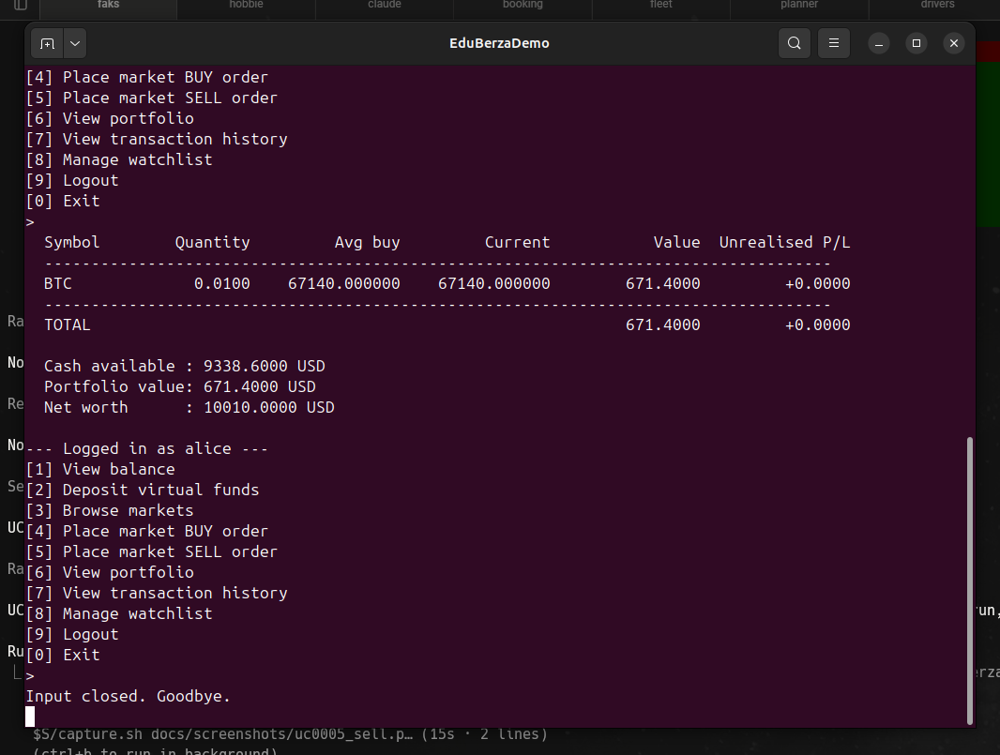

# Use-case 0005 Implementation — Sell

**Initiating actor:** Trader. **Source file:** `server/trade.go`, function `PlaceOrder(s, "sell")`.

## The bug this closes

Before this change, `holdings` had `quantity` and `avg_price` only. The sell
path checked `held < qty` straight against `quantity`, which cannot tell
"owned" apart from "owned, but already committed to another order that has
not settled." `holdings.reserved_quantity` fixes that: the crypto being sold
is reserved before it is removed from the position, and the check is against
`quantity - reserved_quantity`.

## Scenario (implemented)

1. **User** chooses `[5] Place market SELL order`.
2. **System** lists markets (same as UC0004 step 2).
3. **User** enters market symbol, e.g. `ETH`, then quantity `0.5`.
4. **System** opens a transaction and runs:

   ```sql
   BEGIN;

   -- (a) record the order as 'open' — no trade has happened yet
   INSERT INTO orders
       (user_id, market_id, side, type, status, quantity, price)
   VALUES
       ($1, $2, 'sell', 'market', 'open', $3, $4)
   RETURNING id;

   -- (b) lock the holding and check what is actually free to sell
   SELECT quantity, reserved_quantity, avg_price FROM holdings
    WHERE user_id = $1 AND crypto_id = $c FOR UPDATE;
   -- available := quantity - reserved_quantity
   -- abort if missing or available < $qty

   -- (c) reserve: committed to this order, not yet removed from the position
   UPDATE holdings
      SET reserved_quantity = reserved_quantity + $qty, updated_at = now()
    WHERE user_id = $1 AND crypto_id = $c;

   -- (d) settle: a market order fills immediately, so release the
   --     reservation and remove the asset in the same step
   UPDATE holdings
      SET quantity = quantity - $qty,
          reserved_quantity = reserved_quantity - $qty,
          updated_at = now()
    WHERE user_id = $1 AND crypto_id = $c;

   UPDATE users
      SET available_balance = available_balance + $notional,
          invested_balance  = GREATEST(invested_balance - ($avg * $qty), 0),
          updated_at        = now()
    WHERE id = $1;

   INSERT INTO transactions
       (user_id, type, amount, currency, related_order, description)
   VALUES
       ($1, 'sell', $notional, 'USD', $orderId, 'Market sell ...');

   INSERT INTO market_trades
       (market_id, executed_at, price, quantity, side, source)
   VALUES
       ($2, now(), $price, $qty, 'sell', 'user');

   -- (e) settle the order itself — it has now actually been filled
   UPDATE orders SET status = 'executed', executed_at = now() WHERE id = $orderId;

   COMMIT;
   ```

   

5. **System** prints: `Order executed: sell 0.5000 ETH @ 3520.000000 (notional 1760.0000 USD)`.

## Failure path — insufficient holding

If the holding does not exist, or `quantity - reserved_quantity < requested`, the `defer tx.Rollback()` in `server/trade.go` reverts every statement above — including the `open` order, which was never committed — and the user sees:

```
Insufficient holding: trying to sell X, available Y (of Z held, W reserved)
```

## Verified run — the exact scenario from the design review

Run 2026-09-16 against PostgreSQL 16 (`bp_database` on `localhost:5433`).
Alice's ETH/BTC holdings were seeded, then her BTC holding was set to exactly
the scenario that motivated this fix: 2 BTC owned, nothing reserved.

```
$ psql ... -c "SELECT symbol, quantity, reserved_quantity, avg_price
               FROM holdings h JOIN crypto c ON c.id = h.crypto_id
               WHERE user_id = '<alice>';"

 symbol | quantity | reserved_quantity |  avg_price
--------+----------+--------------------+-------------
 BTC    |   2.0000 |             0.0000 | 65000.000000
 ETH    |   0.5000 |             0.0000 |  3500.000000
```

**Step 1 — portfolio before the sell** (`[6] View portfolio`):

```
  Symbol        Quantity      Reserved     Available         Avg buy         Current           Value  Unrealised P/L
  ------------------------------------------------------------------------------------------------------------------
  BTC             2.0000        0.0000        2.0000    65000.000000    67140.000000     134280.0000      +4280.0000
  ETH             0.5000        0.0000        0.5000     3500.000000     3520.000000       1760.0000        +10.0000
  ------------------------------------------------------------------------------------------------------------------
  TOTAL                                                                                  136040.0000      +4290.0000
```

**Step 2 — `[5] Place market SELL order` → `BTC` → `0.5`:**

```
Order executed: sell 0.5000 BTC @ 67140.000000 (notional 33570.0000 USD)
```

**Step 3 — portfolio after the sell:**

```
  BTC             1.5000        0.0000        1.5000    65000.000000    67140.000000     100710.0000      +3210.0000
```

`quantity` dropped from 2.0 to 1.5 and `reserved_quantity` is back to 0.0000
— reserve and settle both happened, inside the one commit, exactly as
designed.

## Verified run — reserve and settle as two distinct, observable steps

The CLI settles a market order in the same transaction it reserves in, so
`reserved_quantity` is never visibly nonzero *outside* a transaction. Run by
hand in one `psql` session (one transaction, so the session sees its own
uncommitted writes) to show the intermediate state that step (c) alone would
leave, before step (d) runs:

```sql
BEGIN;

-- before: Alice owns 2 BTC, none reserved
SELECT quantity, reserved_quantity, quantity - reserved_quantity AS available
  FROM holdings WHERE user_id = '<alice>' AND crypto_id = '<btc>';
--  quantity | reserved_quantity | available
-- ----------+--------------------+-----------
--    2.0000 |             0.0000 |    2.0000

-- step (c): order placed, 0.5 BTC reserved — no trade has happened yet
UPDATE holdings SET reserved_quantity = reserved_quantity + 0.5, updated_at = now()
 WHERE user_id = '<alice>' AND crypto_id = '<btc>';

SELECT quantity, reserved_quantity, quantity - reserved_quantity AS available
  FROM holdings WHERE user_id = '<alice>' AND crypto_id = '<btc>';
--  quantity | reserved_quantity | available
-- ----------+--------------------+-----------
--    2.0000 |             0.5000 |    1.5000

-- step (d): market order settles immediately, reservation released
UPDATE holdings SET quantity = quantity - 0.5, reserved_quantity = reserved_quantity - 0.5, updated_at = now()
 WHERE user_id = '<alice>' AND crypto_id = '<btc>';

SELECT quantity, reserved_quantity, quantity - reserved_quantity AS available
  FROM holdings WHERE user_id = '<alice>' AND crypto_id = '<btc>';
--  quantity | reserved_quantity | available
-- ----------+--------------------+-----------
--    1.5000 |             0.0000 |    1.5000

COMMIT;
```

This is the row that would stay visible to every other connection for as long
as the order stayed `open` — i.e. for as long as it took a matcher to fill
it, once limit orders exist.

## Verified run — two concurrent sells, which is the bug itself

The scenario the design review described: a user should not be able to place
two sell orders whose combined quantity exceeds what they actually hold. With
Alice's BTC holding at 1.5 BTC (0 reserved), two independent CLI processes
were started at the same instant, each selling `1.0 BTC` — together 2.0 BTC,
more than she has:

```
$ ( eduberza-sell-1.0-BTC ) &   # process A
$ ( eduberza-sell-1.0-BTC ) &   # process B
$ wait

=== A ===
Insufficient holding: trying to sell 1.0000, available 0.5000 (of 0.5000 held, 0.0000 reserved)
=== B ===
Order executed: sell 1.0000 BTC @ 67140.000000 (notional 67140.0000 USD)

=== final holding ===
 quantity | reserved_quantity
----------+--------------------
   0.5000 |             0.0000
```

One order settled, one was correctly rejected, and the final `quantity`
(0.5) is consistent with exactly one 1.0 BTC sell having happened against the
1.5 BTC available — not both, and not neither. This is enforced by the
`SELECT ... FOR UPDATE` lock on the holdings row: whichever transaction gets
there second blocks until the first commits, then re-reads the now-current
`quantity`/`reserved_quantity` before deciding.

## Verified — the constraint holds even if application code did not

```sql
UPDATE holdings SET reserved_quantity = quantity + 1 WHERE user_id = '<alice>' AND crypto_id = '<btc>';

ERROR:  new row for relation "holdings" violates check constraint "holdings_check"
```

`CHECK (reserved_quantity >= 0 AND reserved_quantity <= quantity)` in
`schema_creation.sql` makes an inconsistent reservation impossible at the
database level, independent of `trade.go`.
