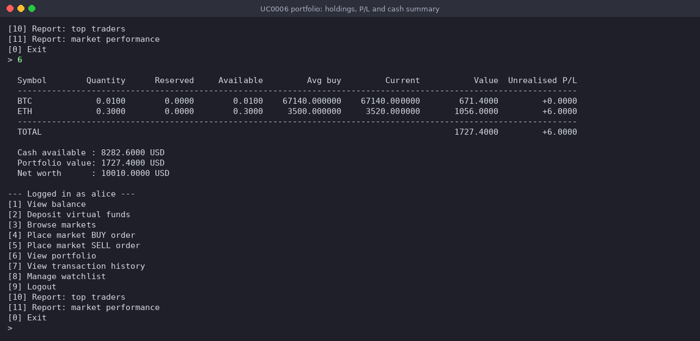
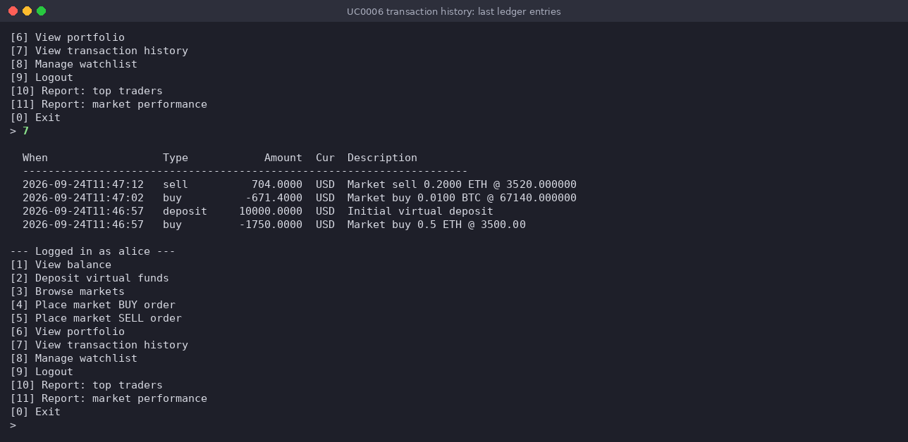

# Use-case 0006 Implementation — Portfolio & transactions

**Initiating actor:** Trader. **Source files:** `server/portfolio.go` (`ShowPortfolio`), `server/account.go` (`ShowTransactions`, `ShowBalance`).

## Scenario (implemented)

### Portfolio

1. **User** chooses `[6] View portfolio`.
2. **System** runs:

   ```sql
   SELECT symbol, quantity,
          COALESCE(reserved_quantity,  0),
          COALESCE(available_quantity, quantity),
          COALESCE(avg_price,      0),
          COALESCE(current_price,  0),
          COALESCE(market_value,   0),
          COALESCE(unrealized_pnl, 0)
     FROM v_portfolio
    WHERE user_id = $1 AND quantity > 0
    ORDER BY symbol;
   ```
3. **System** renders a table with a totals row, then prints the cash summary:

   ```sql
   SELECT available_balance, invested_balance FROM users WHERE id = $1;
   ```

   

### Verified run

Re-run 2026-09-16 against PostgreSQL 16 with the seed data (`data_load.sql`).
Immediately after login, alice's portfolio prints (now with the
`Reserved`/`Available` columns from `holdings.reserved_quantity`):

```
  Symbol        Quantity      Reserved     Available         Avg buy         Current           Value  Unrealised P/L
  ------------------------------------------------------------------------------------------------------------------
  ETH             0.5000        0.0000        0.5000     3500.000000     3520.000000       1760.0000        +10.0000
  ------------------------------------------------------------------------------------------------------------------
  TOTAL                                                                                    1760.0000        +10.0000

  Cash available : 8250.0000 USD
  Portfolio value: 1760.0000 USD
  Net worth      : 10010.0000 USD
```

`Reserved` is 0.0000 here because nothing is mid-sell; see
[UseCase0005Implementation](UseCase0005Implementation.md) for a portfolio
snapshot taken with crypto actually reserved.

### Transaction history

1. **User** chooses `[7] View transaction history`.
2. **System** runs:

   ```sql
   SELECT created_at, type, amount, currency, COALESCE(description, '')
     FROM transactions
    WHERE user_id = $1
    ORDER BY created_at DESC
    LIMIT 20;
   ```

   
