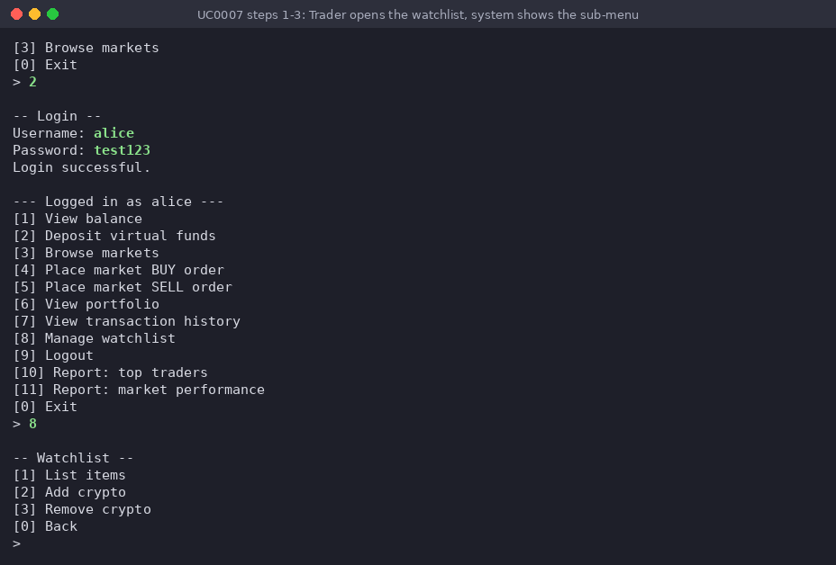
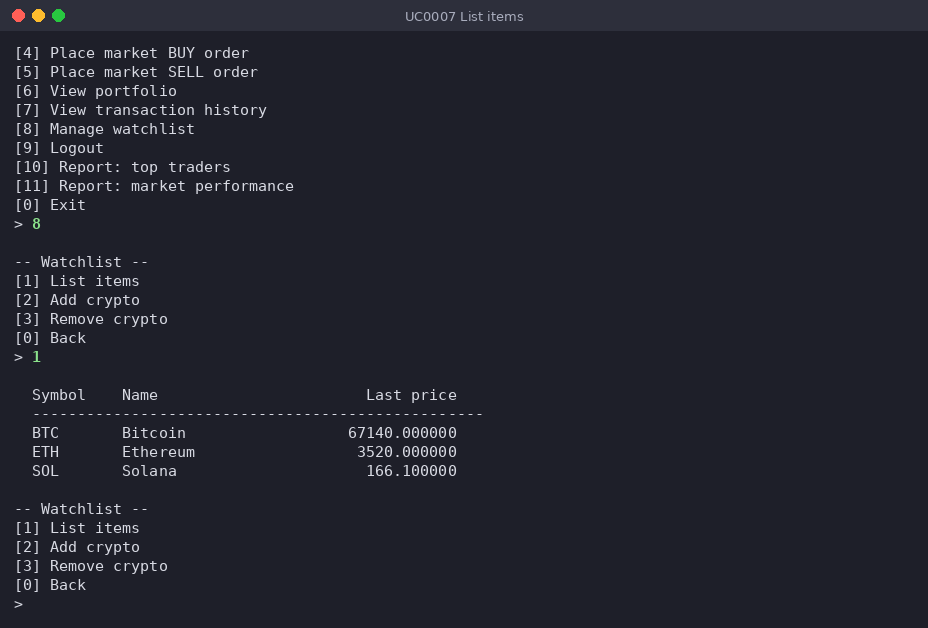
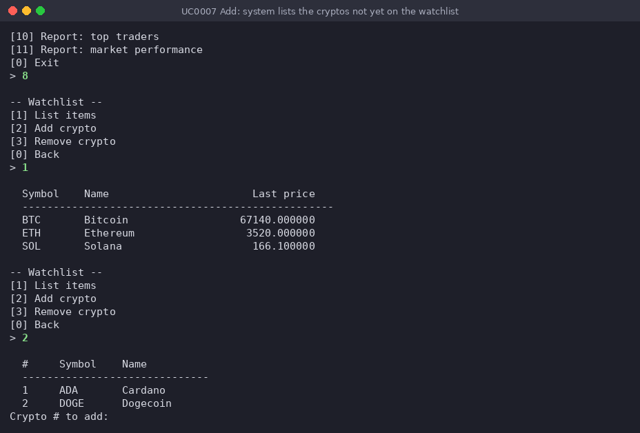
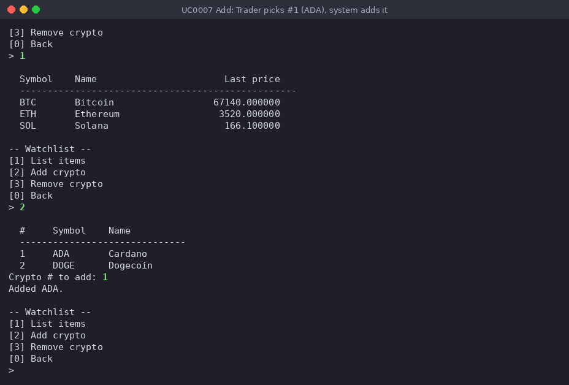
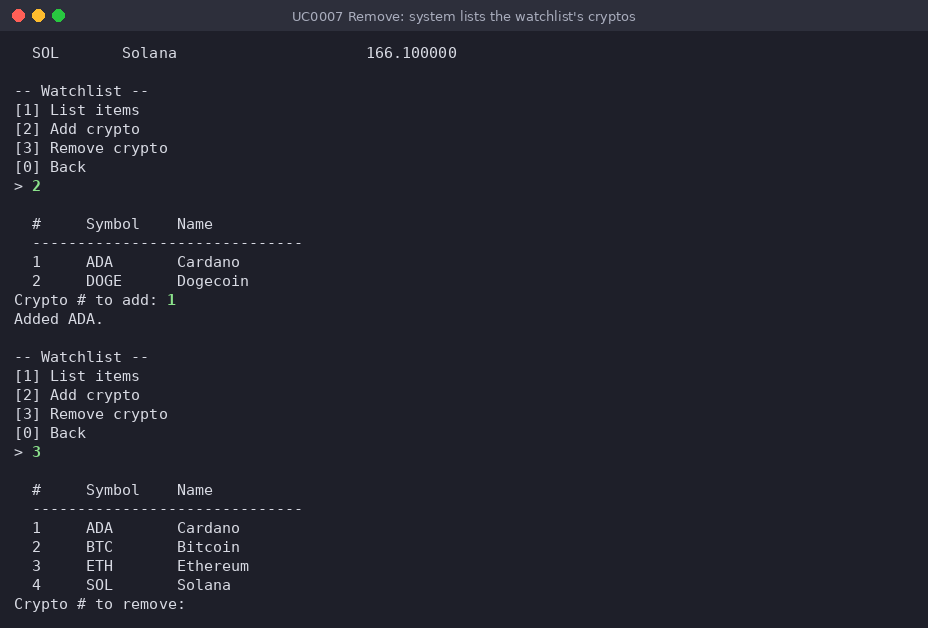
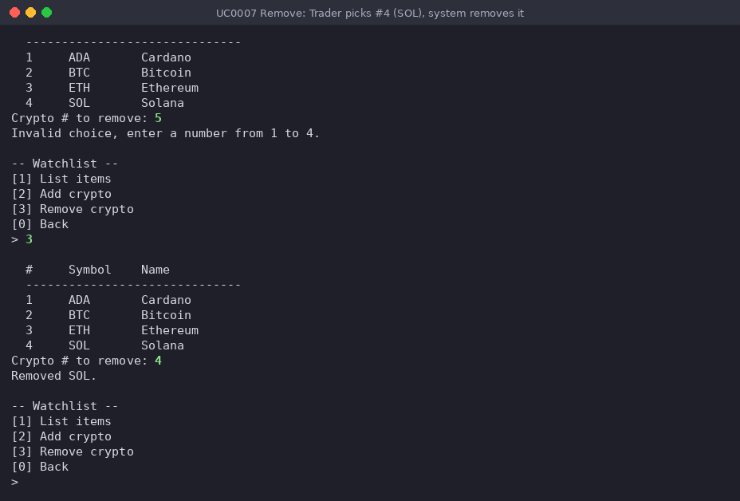
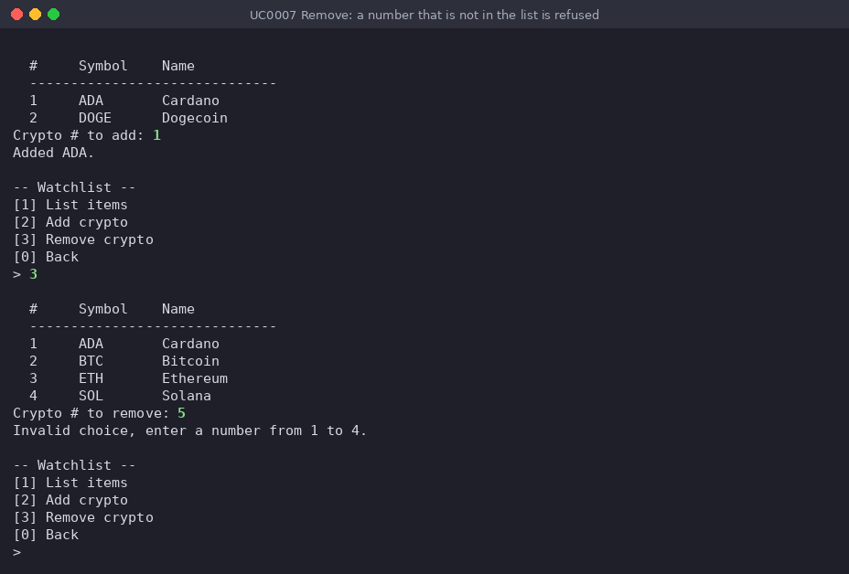
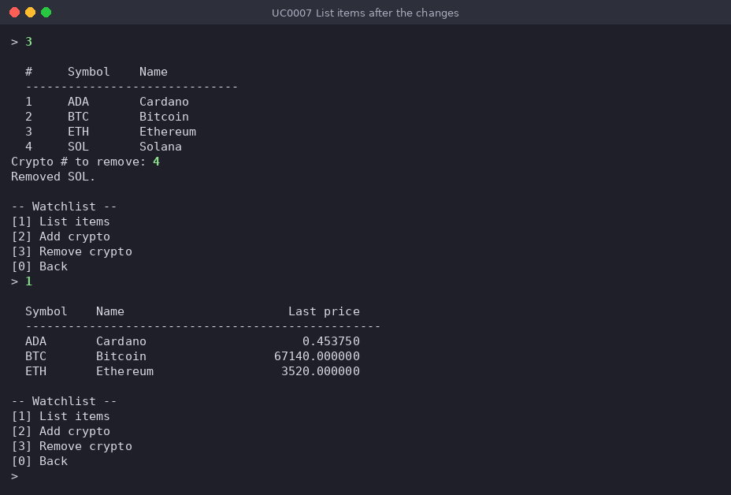

# Use-case 0007 Implementation - Manage watchlist

**Initiating actor:** Trader

**Other actors:** —

A logged-in Trader keeps a list of crypto assets they want to monitor, with the last
price of each. The first time the watchlist is opened the system creates a default
watchlist named "Favorites" for the Trader. From a sub-menu the Trader can list the
watchlist, add a crypto or remove one. The Trader never types a symbol: for adding, the
system lists, numbered, only the cryptos that are not on the watchlist yet, and for
removing, only the cryptos that are on it; the Trader picks one by its number. Adding
a crypto that is already on the list is a no-op (idempotent), and a number that is not
in the list is refused without touching the database.

Original use-case description (P3): [UseCase0007](../P3-UseCaseModel/UseCase0007.md).
Implementation: [`server/watchlist.go`](../../server/watchlist.go), functions
`ManageWatchlist`, `ensureDefaultWatchlist`, `listWatchlist`, `addToWatchlist` and
`removeFromWatchlist`, with `pickNumber` from
[`server/market.go`](../../server/market.go).

All statements run on the `project` schema (the connection sets
`search_path=project,public` in `server/db/db.go`). The SQL below is copied from the
Go code; only the Go source indentation is removed.

The run shown is user `alice` on the seed data, whose watchlist contains BTC, ETH and
SOL. She lists it, adds ADA, tries to remove a number that is not in the list, removes
SOL and lists the result.

## Scenario

1. **Trader** chooses `[8] Manage watchlist` in the authenticated menu (types `8`).
2. **System** makes sure the Trader has a watchlist and takes the id of the oldest one
   (`ensureDefaultWatchlist`; `$1` = the logged-in user's id):

   ```sql
   SELECT id FROM watchlists WHERE user_id = $1 ORDER BY created_at LIMIT 1
   ```

   Only if this returns no row, it creates the default watchlist and uses its id:

   ```sql
   INSERT INTO watchlists (user_id, name) VALUES ($1, 'Favorites') RETURNING id
   ```

   (alice already has the seed watchlist "Favorites", so only the `SELECT` runs.) The
   watchlist id is kept in Go and used as `$1` in all statements below.
3. **System** shows the sub-menu `-- Watchlist --` with `[1] List items`,
   `[2] Add crypto`, `[3] Remove crypto` and `[0] Back`.

   

### List items

4. **Trader** chooses `[1] List items`.
5. **System** lists the cryptos on the watchlist with their last price against USD
   (`listWatchlist`; `$1` = watchlist id):

   ```sql
   SELECT c.symbol, c.name, COALESCE(lp.price, 0)
     FROM watchlist_items wi
     JOIN crypto  c  ON c.id = wi.crypto_id
     LEFT JOIN markets       m  ON m.crypto_id = c.id AND m.quote_currency = 'USD'
     LEFT JOIN v_latest_prices lp ON lp.market_id = m.id
    WHERE wi.watchlist_id = $1
    ORDER BY c.symbol
   ```

   For alice it prints `BTC Bitcoin 67140.000000`, `ETH Ethereum 3520.000000` and
   `SOL Solana 166.100000` (an empty watchlist prints `(watchlist is empty)`), then
   shows the sub-menu again.

   

### Add a crypto

6. **Trader** chooses `[2] Add crypto`.
7. **System** lists, numbered, the cryptos that are not on the watchlist yet
   (`addToWatchlist`; `$1` = watchlist id):

   ```sql
   SELECT c.id, c.symbol, c.name
     FROM crypto c
    WHERE NOT EXISTS (SELECT 1 FROM watchlist_items wi
                       WHERE wi.watchlist_id = $1 AND wi.crypto_id = c.id)
    ORDER BY c.symbol
   ```

   For alice it prints `1 ADA Cardano` and `2 DOGE Dogecoin` and asks
   `Crypto # to add:`. Go keeps each row's crypto id in memory. (If every crypto is
   already on the watchlist, it prints `Every crypto is already on your watchlist.`
   instead.)

   

8. **Trader** picks the crypto by its number in the list: `1` (ADA).
9. **System** adds the crypto of row 1 to the watchlist (`$1` = watchlist id,
   `$2` = the chosen crypto's id); thanks to the unique constraint and
   `ON CONFLICT ... DO NOTHING`, adding a crypto that is already there changes
   nothing:

   ```sql
   INSERT INTO watchlist_items (watchlist_id, crypto_id)
    VALUES ($1, $2)
    ON CONFLICT (watchlist_id, crypto_id) DO NOTHING
   ```

   It prints `Added ADA.` and shows the sub-menu again.

   

### Remove a crypto

10. **Trader** chooses `[3] Remove crypto`.
11. **System** lists, numbered, the cryptos that are on the watchlist
    (`removeFromWatchlist`; `$1` = watchlist id):

    ```sql
    SELECT c.id, c.symbol, c.name
      FROM watchlist_items wi
      JOIN crypto c ON c.id = wi.crypto_id
     WHERE wi.watchlist_id = $1
     ORDER BY c.symbol
    ```

    For alice it now prints `1 ADA Cardano`, `2 BTC Bitcoin`, `3 ETH Ethereum` and
    `4 SOL Solana` and asks `Crypto # to remove:`. Go keeps each row's crypto id in
    memory. (If the watchlist is empty, it prints `Your watchlist is empty.` instead.)

    

12. **Trader** picks the crypto by its number in the list: `4` (SOL).
13. **System** removes the crypto of row 4 from the watchlist (`$1` = watchlist id,
    `$2` = the chosen crypto's id):

    ```sql
    DELETE FROM watchlist_items WHERE watchlist_id = $1 AND crypto_id = $2
    ```

    It prints `Removed SOL.` and shows the sub-menu again.

    

#### Alternate flow 12a — number not in the list

Before removing SOL, alice first chose `[3] Remove crypto` and, at step 12, entered `5`
while only numbers 1–4 were listed. `pickNumber` prints
`Invalid choice, enter a number from 1 to 4.`, the `DELETE` is not run and the sub-menu
is shown again; she then chose `[3]` once more, which returned the scenario to step 11.
The same check applies to the number entered at step 8.



### Verification — list after the changes

Choosing `[1] List items` again runs the query from step 5, which now returns
`ADA Cardano 0.453750`, `BTC Bitcoin 67140.000000` and `ETH Ethereum 3520.000000`:
ADA was added and SOL removed. `[0] Back` returns to the authenticated menu.


